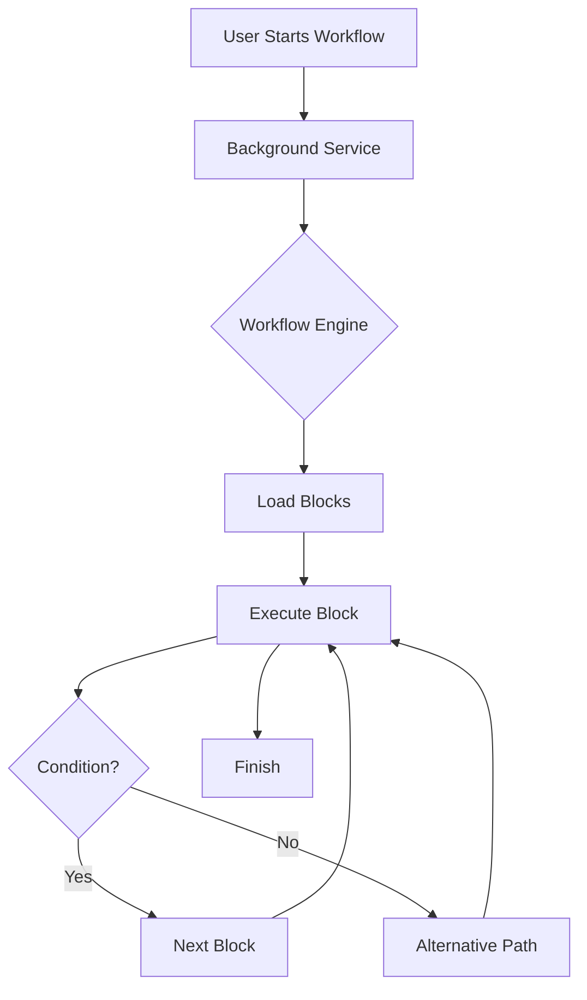

# Source Code Analysis & Documentation Verification Report

**Date**: 2026-01-14
**Total Files Scanned**: 445

## Summary

- **Fully Documented**: 406
- **Missing Documentation**: 0
- **Inconsistent Documentation**: 0
- **Errors/Skipped**: 39

## 1. Code-Document Mapping & Status

| Source File | Status | Notes |
|-------------|--------|-------|
| background/BackgroundEventsListeners.js | ✅ |  |
| background/BackgroundOffscreen.js | ✅ |  |
| background/BackgroundUtils.js | ✅ |  |
| background/BackgroundWorkflowTriggers.js | ✅ |  |
| background/BackgroundWorkflowUtils.js | ✅ |  |
| background/index.js | ✅ |  |
| components/block/BlockBase.vue | ✅ |  |
| components/block/BlockBasic.vue | ✅ |  |
| components/block/BlockBasicWithFallback.vue | ✅ |  |
| components/block/BlockConditions.vue | ✅ |  |
| components/block/BlockDelay.vue | ✅ |  |
| components/block/BlockElementExists.vue | ✅ |  |
| components/block/BlockGroup.vue | ✅ |  |
| components/block/BlockGroup2.vue | ✅ |  |
| components/block/BlockLoopBreakpoint.vue | ✅ |  |
| components/block/BlockNote.vue | ✅ |  |
| components/block/BlockPackage.vue | ✅ |  |
| components/block/BlockRepeatTask.vue | ✅ |  |
| components/content/selector/SelectorBlocks.vue | ✅ |  |
| components/content/selector/SelectorElementList.vue | ✅ |  |
| components/content/selector/SelectorElementsDetail.vue | ✅ |  |
| components/content/selector/SelectorQuery.vue | ✅ |  |
| components/content/shared/SharedElementHighlighter.vue | ✅ |  |
| components/content/shared/SharedElementSelector.vue | ✅ |  |
| components/newtab/app/AppLogs.vue | ✅ |  |
| components/newtab/app/AppLogsItem.vue | ✅ |  |
| components/newtab/app/AppLogsItemRunning.vue | ✅ |  |
| components/newtab/app/AppLogsItems.vue | ✅ |  |
| components/newtab/app/AppSidebar.vue | ✅ |  |
| components/newtab/app/AppSurvey.vue | ✅ |  |
| components/newtab/logs/LogsDataViewer.vue | ✅ |  |
| components/newtab/logs/LogsFilters.vue | ✅ |  |
| components/newtab/logs/LogsHistory.vue | ✅ |  |
| components/newtab/logs/LogsTable.vue | ✅ |  |
| components/newtab/logs/LogsVariables.vue | ✅ |  |
| components/newtab/package/PackageDetails.vue | ✅ |  |
| components/newtab/package/PackageSettingIOSelect.vue | ✅ |  |
| components/newtab/package/PackageSettings.vue | ✅ |  |
| components/newtab/settings/SettingsBackupItems.vue | ✅ |  |
| components/newtab/settings/SettingsCloudBackup.vue | ✅ |  |
| components/newtab/shared/SharedCard.vue | ✅ |  |
| components/newtab/shared/SharedCodemirror.vue | ✅ |  |
| components/newtab/shared/SharedConditionBuilder/ConditionBuilderInputs.vue | ✅ |  |
| components/newtab/shared/SharedConditionBuilder/index.vue | ✅ |  |
| components/newtab/shared/SharedElSelectorActions.vue | ✅ |  |
| components/newtab/shared/SharedLogsTable.vue | ✅ |  |
| components/newtab/shared/SharedPermissionsModal.vue | ✅ |  |
| components/newtab/shared/SharedWorkflowState.vue | ✅ |  |
| components/newtab/shared/SharedWorkflowTriggers.vue | ✅ |  |
| components/newtab/shared/SharedWysiwyg.vue | ✅ |  |
| components/newtab/storage/StorageCredentials.vue | ✅ |  |
| components/newtab/storage/StorageEditTable.vue | ✅ |  |
| components/newtab/storage/StorageTables.vue | ✅ |  |
| components/newtab/storage/StorageVariables.vue | ✅ |  |
| components/newtab/workflow/edit/BlockSetting/BlockSettingGeneral.vue | ✅ |  |
| components/newtab/workflow/edit/BlockSetting/BlockSettingOnError.vue | ✅ |  |
| components/newtab/workflow/edit/EditAiWorkflow.vue | ✅ |  |
| components/newtab/workflow/edit/EditAttributeValue.vue | ✅ |  |
| components/newtab/workflow/edit/EditAutocomplete.vue | ✅ |  |
| components/newtab/workflow/edit/EditBlockSettings.vue | ✅ |  |
| components/newtab/workflow/edit/EditBrowserEvent.vue | ✅ |  |
| components/newtab/workflow/edit/EditClipboard.vue | ✅ |  |
| components/newtab/workflow/edit/EditCloseTab.vue | ✅ |  |
| components/newtab/workflow/edit/EditConditions.vue | ✅ |  |
| components/newtab/workflow/edit/EditCookie.vue | ✅ |  |
| components/newtab/workflow/edit/EditCreateElement.vue | ✅ |  |
| components/newtab/workflow/edit/EditDataMapping.vue | ✅ |  |
| components/newtab/workflow/edit/EditDelay.vue | ✅ |  |
| components/newtab/workflow/edit/EditDeleteData.vue | ✅ |  |
| components/newtab/workflow/edit/EditElementExists.vue | ✅ |  |
| components/newtab/workflow/edit/EditExecuteWorkflow.vue | ✅ |  |
| components/newtab/workflow/edit/EditExportData.vue | ✅ |  |
| components/newtab/workflow/edit/EditForms.vue | ✅ |  |
| components/newtab/workflow/edit/EditGetText.vue | ✅ |  |
| components/newtab/workflow/edit/EditGoogleDrive.vue | ✅ |  |
| components/newtab/workflow/edit/EditGoogleSheets.vue | ✅ |  |
| components/newtab/workflow/edit/EditGoogleSheetsDrive.vue | ✅ |  |
| components/newtab/workflow/edit/EditHandleDialog.vue | ✅ |  |
| components/newtab/workflow/edit/EditHandleDownload.vue | ✅ |  |
| components/newtab/workflow/edit/EditIncreaseVariable.vue | ✅ |  |
| components/newtab/workflow/edit/EditInsertData.vue | ✅ |  |
| components/newtab/workflow/edit/EditInteractionBase.vue | ✅ |  |
| components/newtab/workflow/edit/EditJavascriptCode.vue | ✅ |  |
| components/newtab/workflow/edit/EditLink.vue | ✅ |  |
| components/newtab/workflow/edit/EditLogData.vue | ✅ |  |
| components/newtab/workflow/edit/EditLoopData.vue | ✅ |  |
| components/newtab/workflow/edit/EditLoopElements.vue | ✅ |  |
| components/newtab/workflow/edit/EditNewTab.vue | ✅ |  |
| components/newtab/workflow/edit/EditNewWindow.vue | ✅ |  |
| components/newtab/workflow/edit/EditNotification.vue | ✅ |  |
| components/newtab/workflow/edit/EditParameterPrompt.vue | ✅ |  |
| components/newtab/workflow/edit/EditPressKey.vue | ✅ |  |
| components/newtab/workflow/edit/EditProxy.vue | ✅ |  |
| components/newtab/workflow/edit/EditRegexVariable.vue | ✅ |  |
| components/newtab/workflow/edit/EditSaveAssets.vue | ✅ |  |
| components/newtab/workflow/edit/EditScrollElement.vue | ✅ |  |
| components/newtab/workflow/edit/EditSliceVariable.vue | ✅ |  |
| components/newtab/workflow/edit/EditSortData.vue | ✅ |  |
| components/newtab/workflow/edit/EditSwitchTab.vue | ✅ |  |
| components/newtab/workflow/edit/EditSwitchTo.vue | ✅ |  |
| components/newtab/workflow/edit/EditTabURL.vue | ✅ |  |
| components/newtab/workflow/edit/EditTakeScreenshot.vue | ✅ |  |
| components/newtab/workflow/edit/EditTrigger.vue | ✅ |  |
| components/newtab/workflow/edit/EditTriggerEvent.vue | ✅ |  |
| components/newtab/workflow/edit/EditUploadFile.vue | ✅ |  |
| components/newtab/workflow/edit/EditWaitConnections.vue | ✅ |  |
| components/newtab/workflow/edit/EditWebhook.vue | ✅ |  |
| components/newtab/workflow/edit/EditWhileLoop.vue | ✅ |  |
| components/newtab/workflow/edit/EditWorkflowParameters.vue | ✅ |  |
| components/newtab/workflow/edit/EditWorkflowState.vue | ✅ |  |
| components/newtab/workflow/edit/InsertWorkflowData.vue | ✅ |  |
| components/newtab/workflow/edit/Parameter/ParameterCheckboxValue.vue | ✅ |  |
| components/newtab/workflow/edit/Parameter/ParameterInputOptions.vue | ✅ |  |
| components/newtab/workflow/edit/Parameter/ParameterInputValue.vue | ✅ |  |
| components/newtab/workflow/edit/Parameter/ParameterJsonValue.vue | ✅ |  |
| components/newtab/workflow/edit/Trigger/TriggerContextMenu.vue | ✅ |  |
| components/newtab/workflow/edit/Trigger/TriggerCronJob.vue | ✅ |  |
| components/newtab/workflow/edit/Trigger/TriggerDate.vue | ✅ |  |
| components/newtab/workflow/edit/Trigger/TriggerElementChange.vue | ✅ |  |
| components/newtab/workflow/edit/Trigger/TriggerElementOptions.vue | ✅ |  |
| components/newtab/workflow/edit/Trigger/TriggerInterval.vue | ✅ |  |
| components/newtab/workflow/edit/Trigger/TriggerKeyboardShortcut.vue | ✅ |  |
| components/newtab/workflow/edit/Trigger/TriggerSpecificDay.vue | ✅ |  |
| components/newtab/workflow/edit/Trigger/TriggerVisitWeb.vue | ✅ |  |
| components/newtab/workflow/edit/TriggerEvent/TriggerEventInput.vue | ✅ |  |
| components/newtab/workflow/edit/TriggerEvent/TriggerEventKeyboard.vue | ✅ |  |
| components/newtab/workflow/edit/TriggerEvent/TriggerEventMouse.vue | ✅ |  |
| components/newtab/workflow/edit/TriggerEvent/TriggerEventTouch.vue | ✅ |  |
| components/newtab/workflow/edit/TriggerEvent/TriggerEventWheel.vue | ✅ |  |
| components/newtab/workflow/editor/EditorAddPackage.vue | ✅ |  |
| components/newtab/workflow/editor/EditorCustomEdge.vue | ✅ |  |
| components/newtab/workflow/editor/EditorDebugging.vue | ✅ |  |
| components/newtab/workflow/editor/EditorLocalActions.vue | ✅ |  |
| components/newtab/workflow/editor/EditorLocalCtxMenu.vue | ✅ |  |
| components/newtab/workflow/editor/EditorLocalSavedBlocks.vue | ✅ |  |
| components/newtab/workflow/editor/EditorLogs.vue | ✅ |  |
| components/newtab/workflow/editor/EditorPkgActions.vue | ✅ |  |
| components/newtab/workflow/editor/EditorSearchBlocks.vue | ✅ |  |
| components/newtab/workflow/editor/EditorUsedCredentials.vue | ✅ |  |
| components/newtab/workflow/settings/event/EventCodeAction.vue | ✅ |  |
| components/newtab/workflow/settings/event/EventCodeHTTP.vue | ✅ |  |
| components/newtab/workflow/settings/SettingsBlocks.vue | ✅ |  |
| components/newtab/workflow/settings/SettingsEvents.vue | ✅ |  |
| components/newtab/workflow/settings/SettingsGeneral.vue | ✅ |  |
| components/newtab/workflow/settings/SettingsTable.vue | ✅ |  |
| components/newtab/workflow/WorkflowBlockList.vue | ✅ |  |
| components/newtab/workflow/WorkflowDataTable.vue | ✅ |  |
| components/newtab/workflow/WorkflowDetailsCard.vue | ✅ |  |
| components/newtab/workflow/WorkflowEditBlock.vue | ✅ |  |
| components/newtab/workflow/WorkflowEditor.vue | ✅ |  |
| components/newtab/workflow/WorkflowGlobalData.vue | ✅ |  |
| components/newtab/workflow/WorkflowProtect.vue | ✅ |  |
| components/newtab/workflow/WorkflowRunning.vue | ✅ |  |
| components/newtab/workflow/WorkflowSettings.vue | ✅ |  |
| components/newtab/workflow/WorkflowShare.vue | ✅ |  |
| components/newtab/workflow/WorkflowSharedActions.vue | ✅ |  |
| components/newtab/workflow/WorkflowShareTeam.vue | ✅ |  |
| components/newtab/workflows/WorkflowsFolder.vue | ✅ |  |
| components/newtab/workflows/WorkflowsHosted.vue | ✅ |  |
| components/newtab/workflows/WorkflowsLocal.vue | ✅ |  |
| components/newtab/workflows/WorkflowsLocalCard.vue | ✅ |  |
| components/newtab/workflows/WorkflowsShared.vue | ✅ |  |
| components/newtab/workflows/WorkflowsUserTeam.vue | ✅ |  |
| components/popup/home/HomeSelectBlock.vue | ✅ |  |
| components/popup/home/HomeStartRecording.vue | ✅ |  |
| components/popup/home/HomeTeamWorkflows.vue | ✅ |  |
| components/popup/home/HomeWorkflowCard.vue | ✅ |  |
| components/transitions/TransitionExpand.vue | ✅ |  |
| components/transitions/TransitionSlide.vue | ✅ |  |
| components/ui/UiAutocomplete.vue | ✅ |  |
| components/ui/UiButton.vue | ✅ |  |
| components/ui/UiCheckbox.vue | ✅ |  |
| components/ui/UiDialog.vue | ✅ |  |
| components/ui/UiExpand.vue | ✅ |  |
| components/ui/UiFileInput.vue | ✅ |  |
| components/ui/UiImg.vue | ✅ |  |
| components/ui/UiInput.vue | ✅ |  |
| components/ui/UiModal.vue | ✅ |  |
| components/ui/UiPaginatedSelect.vue | ✅ |  |
| components/ui/UiPagination.vue | ✅ |  |
| components/ui/UiPopover.vue | ✅ |  |
| components/ui/UiRadio.vue | ✅ |  |
| components/ui/UiSelect.vue | ✅ |  |
| components/ui/UiSwitch.vue | ✅ |  |
| components/ui/UiTable.vue | ✅ |  |
| components/ui/UiTabPanel.vue | ✅ |  |
| components/ui/UiTabs.vue | ✅ |  |
| components/ui/UiTextarea.vue | ✅ |  |
| composable/blockValidation.js | ✅ |  |
| composable/commandManager.js | ✅ |  |
| composable/componentId.js | ✅ |  |
| composable/dialog.js | ✅ |  |
| composable/editorBlock.js | ✅ |  |
| composable/groupTooltip.js | ✅ |  |
| composable/hasPermissions.js | ✅ |  |
| composable/liveQuery.js | ✅ |  |
| composable/shortcut.js | ✅ |  |
| composable/theme.js | ✅ |  |
| content/blocksHandler/handlerAttributeValue.js | ✅ |  |
| content/blocksHandler/handlerClipboard.js | ✅ |  |
| content/blocksHandler/handlerConditions.js | ✅ |  |
| content/blocksHandler/handlerCreateElement.js | ✅ |  |
| content/blocksHandler/handlerElementExists.js | ✅ |  |
| content/blocksHandler/handlerElementScroll.js | ✅ |  |
| content/blocksHandler/handlerEventClick.js | ✅ |  |
| content/blocksHandler/handlerForms.js | ✅ |  |
| content/blocksHandler/handlerGetText.js | ✅ |  |
| content/blocksHandler/handlerHoverElement.js | ✅ |  |
| content/blocksHandler/handlerJavascriptCode.js | ✅ |  |
| content/blocksHandler/handlerLink.js | ✅ |  |
| content/blocksHandler/handlerLoopData.js | ✅ |  |
| content/blocksHandler/handlerLoopElements.js | ✅ |  |
| content/blocksHandler/handlerPressKey.js | ✅ |  |
| content/blocksHandler/handlerSaveAssets.js | ✅ |  |
| content/blocksHandler/handlerSwitchTo.js | ✅ |  |
| content/blocksHandler/handlerTakeScreenshot.js | ✅ |  |
| content/blocksHandler/handlerTriggerEvent.js | ✅ |  |
| content/blocksHandler/handlerUploadFile.js | ✅ |  |
| content/blocksHandler/handlerVerifySelector.js | ✅ |  |
| content/blocksHandler.js | ✅ |  |
| content/commandPalette/App.vue | ✅ |  |
| content/commandPalette/compsUi.js | ✅ |  |
| content/commandPalette/index.js | ✅ |  |
| content/commandPalette/main.js | ✅ |  |
| content/elementObserver.js | ✅ |  |
| content/elementSelector/App.vue | ✅ |  |
| content/elementSelector/compsUi.js | ✅ |  |
| content/elementSelector/generateElementsSelector.js | ✅ |  |
| content/elementSelector/getSelectorOptions.js | ✅ |  |
| content/elementSelector/listSelector.js | ✅ |  |
| content/elementSelector/main.js | ✅ |  |
| content/elementSelector/selectorFrameContext.js | ✅ |  |
| content/handleSelector.js | ✅ |  |
| content/index.js | ✅ |  |
| content/injectAppStyles.js | ✅ |  |
| content/services/recordWorkflow/addBlock.js | ✅ |  |
| content/services/recordWorkflow/App.vue | ✅ |  |
| content/services/recordWorkflow/main.js | ✅ |  |
| content/services/recordWorkflow/recordEvents.js | ✅ |  |
| content/services/shortcutListener.js | ✅ |  |
| content/services/webService.js | ✅ |  |
| content/showExecutedBlock.js | ✅ |  |
| content/synchronizedLock.js | ✅ |  |
| content/utils.js | ✅ |  |
| directives/VAutofocus.js | ✅ |  |
| directives/VClosePopover.js | ✅ |  |
| directives/VTooltip.js | ✅ |  |
| execute/index.js | ✅ |  |
| lib/compsUi.js | ✅ |  |
| lib/cronstrue.js | ✅ |  |
| lib/findSelector.js | ✅ |  |
| lib/pinia.js | ✅ |  |
| lib/query-selector-shadow-dom/index.js | ✅ |  |
| lib/query-selector-shadow-dom/normalize.js | ✅ |  |
| lib/tippy.js | ✅ |  |
| lib/vRemixicon.js | ✅ |  |
| lib/vueI18n.js | ✅ |  |
| newtab/App.vue | ✅ |  |
| newtab/pages/AIWorkflowGenerator.vue | ✅ |  |
| newtab/pages/Login.vue | ✅ |  |
| newtab/pages/Packages.vue | ✅ |  |
| newtab/pages/Recording.vue | ✅ |  |
| newtab/pages/ScheduledWorkflow.vue | ✅ |  |
| newtab/pages/settings/SettingsBackup.vue | ✅ |  |
| newtab/pages/settings/SettingsDriveMigration.vue | ✅ |  |
| newtab/pages/settings/SettingsIndex.vue | ✅ |  |
| newtab/pages/settings/SettingsShortcuts.vue | ✅ |  |
| newtab/pages/Settings.vue | ✅ |  |
| newtab/pages/storage/Tables.vue | ✅ |  |
| newtab/pages/Storage.vue | ✅ |  |
| newtab/pages/workflows/Host.vue | ✅ |  |
| newtab/pages/workflows/index.vue | ✅ |  |
| newtab/pages/workflows/Shared.vue | ✅ |  |
| newtab/pages/workflows/[id].vue | ✅ |  |
| newtab/pages/Workflows.vue | ✅ |  |
| newtab/utils/blocksValidation.js | ✅ |  |
| newtab/utils/elementSelector.js | ✅ |  |
| newtab/utils/RecordWorkflowUtils.js | ✅ |  |
| newtab/utils/startRecordWorkflow.js | ✅ |  |
| params/App.vue | ✅ |  |
| popup/pages/Home.vue | ✅ |  |
| sandbox/index.js | ✅ |  |
| sandbox/utils/handleBlockExpression.js | ✅ |  |
| sandbox/utils/handleConditionCode.js | ✅ |  |
| sandbox/utils/handleJavascriptBlock.js | ✅ |  |
| service/browser-api/browser-api-map.js | ✅ |  |
| service/browser-api/BrowserAPIEventHandler.js | ✅ |  |
| service/browser-api/BrowserAPIService.js | ✅ |  |
| service/renderer/RendererWorkflowService.js | ✅ |  |
| services/ai/LangGraphAgent.js | ✅ |  |
| services/ai/OllamaClient.js | ✅ |  |
| services/ai/prompts/workflow-generation.js | ✅ |  |
| services/ai/WorkflowGenerator.js | ✅ |  |
| services/supabase/SupabaseClient.js | ✅ |  |
| services/workflowSync/WorkflowSyncService.js | ✅ |  |
| stores/folder.js | ✅ |  |
| stores/hostedWorkflow.js | ✅ |  |
| stores/main.js | ✅ |  |
| stores/package.js | ✅ |  |
| stores/sharedWorkflow.js | ✅ |  |
| stores/teamWorkflow.js | ✅ |  |
| stores/user.js | ✅ |  |
| stores/workflow.js | ✅ |  |
| utils/api.js | ✅ |  |
| utils/apiAdapter.js | ✅ |  |
| utils/auth.js | ✅ |  |
| utils/codeEditorAutocomplete.js | ✅ |  |
| utils/compareBlockValue.js | ✅ |  |
| utils/convertWorkflowData.js | ✅ |  |
| utils/credentialUtil.js | ✅ |  |
| utils/dataExporter.js | ✅ |  |
| utils/dataMigration.js | ✅ |  |
| utils/decryptFlow.js | ✅ |  |
| utils/editor/DroppedNode.js | ✅ |  |
| utils/editor/editorAutocomplete.js | ✅ |  |
| utils/editor/EditorCommands.js | ✅ |  |
| utils/FindElement.js | ✅ |  |
| utils/getAIPoweredInfo.js | ✅ |  |
| utils/getBlockMessage.js | ✅ |  |
| utils/getFile.js | ✅ |  |
| utils/getPassKey.js | ✅ |  |
| utils/getSharedData.js | ✅ |  |
| utils/getTranslateLog.js | ✅ |  |
| utils/googleSheetsApi.js | ✅ |  |
| utils/handleFormElement.js | ✅ |  |
| utils/helper.js | ✅ |  |
| utils/message.js | ✅ |  |
| utils/mockBrowser.js | ✅ |  |
| utils/openGDriveFilePicker.js | ✅ |  |
| utils/recordKeys.js | ✅ |  |
| utils/serialization.js | ✅ |  |
| utils/simulateEvent/index.js | ✅ |  |
| utils/simulateEvent/mouseEvent.js | ✅ |  |
| utils/triggerText.js | ✅ |  |
| utils/workflowData.js | ✅ |  |
| utils/workflowTrigger.js | ✅ |  |
| workflowEngine/blocksHandler/handlerActiveTab.js | ✅ |  |
| workflowEngine/blocksHandler/handlerAiWorkflow.js | ✅ |  |
| workflowEngine/blocksHandler/handlerBlockPackage.js | ✅ |  |
| workflowEngine/blocksHandler/handlerBlocksGroup.js | ✅ |  |
| workflowEngine/blocksHandler/handlerBrowserEvent.js | ✅ |  |
| workflowEngine/blocksHandler/handlerClipboard.js | ✅ |  |
| workflowEngine/blocksHandler/handlerCloseTab.js | ✅ |  |
| workflowEngine/blocksHandler/handlerConditions.js | ✅ |  |
| workflowEngine/blocksHandler/handlerCookie.js | ✅ |  |
| workflowEngine/blocksHandler/handlerCreateElement.js | ✅ |  |
| workflowEngine/blocksHandler/handlerDataMapping.js | ✅ |  |
| workflowEngine/blocksHandler/handlerDelay.js | ✅ |  |
| workflowEngine/blocksHandler/handlerDeleteData.js | ✅ |  |
| workflowEngine/blocksHandler/handlerElementExists.js | ✅ |  |
| workflowEngine/blocksHandler/handlerExecuteWorkflow.js | ✅ |  |
| workflowEngine/blocksHandler/handlerExportData.js | ✅ |  |
| workflowEngine/blocksHandler/handlerForwardPage.js | ✅ |  |
| workflowEngine/blocksHandler/handlerGoBack.js | ✅ |  |
| workflowEngine/blocksHandler/handlerGoogleDrive.js | ✅ |  |
| workflowEngine/blocksHandler/handlerGoogleSheets.js | ✅ |  |
| workflowEngine/blocksHandler/handlerGoogleSheetsDrive.js | ✅ |  |
| workflowEngine/blocksHandler/handlerHandleDialog.js | ✅ |  |
| workflowEngine/blocksHandler/handlerHandleDownload.js | ✅ |  |
| workflowEngine/blocksHandler/handlerHoverElement.js | ✅ |  |
| workflowEngine/blocksHandler/handlerIncreaseVariable.js | ✅ |  |
| workflowEngine/blocksHandler/handlerInsertData.js | ✅ |  |
| workflowEngine/blocksHandler/handlerInteractionBlock.js | ✅ |  |
| workflowEngine/blocksHandler/handlerJavascriptCode.js | ✅ |  |
| workflowEngine/blocksHandler/handlerLink.js | ✅ |  |
| workflowEngine/blocksHandler/handlerLogData.js | ✅ |  |
| workflowEngine/blocksHandler/handlerLoopBreakpoint.js | ✅ |  |
| workflowEngine/blocksHandler/handlerLoopData.js | ✅ |  |
| workflowEngine/blocksHandler/handlerLoopElements.js | ✅ |  |
| workflowEngine/blocksHandler/handlerNewTab.js | ✅ |  |
| workflowEngine/blocksHandler/handlerNewWindow.js | ✅ |  |
| workflowEngine/blocksHandler/handlerNotification.js | ✅ |  |
| workflowEngine/blocksHandler/handlerParameterPrompt.js | ✅ |  |
| workflowEngine/blocksHandler/handlerProxy.js | ✅ |  |
| workflowEngine/blocksHandler/handlerRegexVariable.js | ✅ |  |
| workflowEngine/blocksHandler/handlerReloadTab.js | ✅ |  |
| workflowEngine/blocksHandler/handlerRepeatTask.js | ✅ |  |
| workflowEngine/blocksHandler/handlerSaveAssets.js | ✅ |  |
| workflowEngine/blocksHandler/handlerSliceVariable.js | ✅ |  |
| workflowEngine/blocksHandler/handlerSortData.js | ✅ |  |
| workflowEngine/blocksHandler/handlerSwitchTab.js | ✅ |  |
| workflowEngine/blocksHandler/handlerSwitchTo.js | ✅ |  |
| workflowEngine/blocksHandler/handlerTabUrl.js | ✅ |  |
| workflowEngine/blocksHandler/handlerTakeScreenshot.js | ✅ |  |
| workflowEngine/blocksHandler/handlerTrigger.js | ✅ |  |
| workflowEngine/blocksHandler/handlerWaitConnections.js | ✅ |  |
| workflowEngine/blocksHandler/handlerWebhook.js | ✅ |  |
| workflowEngine/blocksHandler/handlerWhileLoop.js | ✅ |  |
| workflowEngine/blocksHandler/handlerWorkflowState.js | ✅ |  |
| workflowEngine/blocksHandler.js | ✅ |  |
| workflowEngine/helper.js | ✅ |  |
| workflowEngine/injectContentScript.js | ✅ |  |
| workflowEngine/templating/index.js | ✅ |  |
| workflowEngine/templating/mustacheReplacer.js | ✅ |  |
| workflowEngine/templating/renderString.js | ✅ |  |
| workflowEngine/templating/templatingFunctions.js | ✅ |  |
| workflowEngine/utils/conditionCode.js | ✅ |  |
| workflowEngine/utils/javascriptBlockUtil.js | ✅ |  |
| workflowEngine/utils/testConditions.js | ✅ |  |
| workflowEngine/utils/webhookUtil.js | ✅ |  |
| workflowEngine/WorkflowEngine.js | ✅ |  |
| workflowEngine/workflowEvent.js | ✅ |  |
| workflowEngine/WorkflowLogger.js | ✅ |  |
| workflowEngine/WorkflowManager.js | ✅ |  |
| workflowEngine/WorkflowState.js | ✅ |  |
| workflowEngine/WorkflowWorker.js | ✅ |  |

## 2. Inconsistencies & Update Suggestions

No inconsistencies found in existing documentation.
## 3. Critical Functional Flowcharts

*(Placeholder for critical flowcharts. Based on analysis, the core workflow engine is located in `src/workflowEngine`)*

### Workflow Execution Flow

