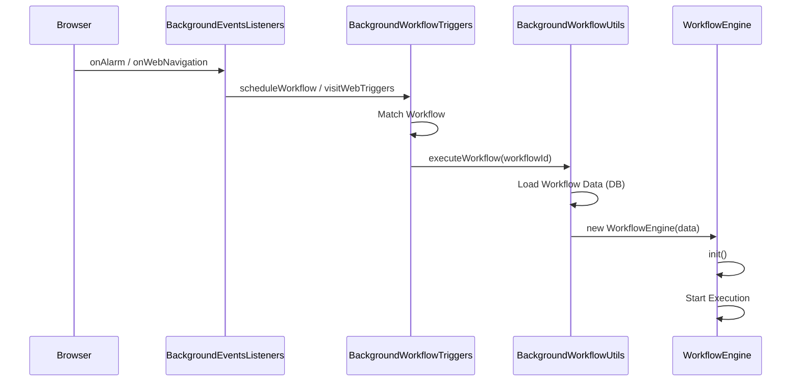

# Background Module Analysis

## Description
The Background module runs as a Service Worker (MV3) and acts as the central controller for the extension. It handles browser events, manages triggers, and coordinates communication between the Popup, Dashboard, and Content Scripts.

## Key Files

### `src/background/index.js`
The entry point for the background service worker.
- **Responsibilities**:
    - Sets up event listeners for Alarms, Commands, Runtime messages, and Web Navigation.
    - Initializes the `MessageListener` to handle internal extension messaging.
    - Registers context menus.

### `src/background/BackgroundEventsListeners.js`
Contains static methods for handling specific browser events.
- **`onAlarms`**: Triggers scheduled workflows (Cron jobs).
- **`onCommand`**: Handles keyboard shortcuts (e.g., open dashboard).
- **`onWebNavigationCompleted`**: Used for "Visit Web" triggers.

### `src/background/BackgroundWorkflowTriggers.js`
Manages the logic for checking and executing workflow triggers.
- **`visitWebTriggers`**: Checks if the visited URL matches any "Visit Web" trigger.
- **`scheduleWorkflow`**: Executes workflows based on Cron or Date triggers.
- **`contextMenu`**: Executes workflows triggered from the browser context menu.

### `src/background/BackgroundWorkflowUtils.js`
Helper class for workflow execution management in the background.
- **`executeWorkflow`**: Loads workflow data from storage and instantiates `WorkflowEngine`.
- **`stopExecution`**: Stops a running workflow.

## Call Flow: Trigger Execution

## Functional Components

1.  **Messaging System**:
    - Uses a custom `MessageListener` to route messages like `workflow:execute`, `fetch` (proxy), and `get:tab-screenshot`.

2.  **Trigger Management**:
    - **Cron/Interval**: Uses `browser.alarms` API.
    - **Visit Web**: Monitors `webNavigation` events.
    - **Context Menu**: Dynamically creates menu items based on workflow settings.

3.  **Offscreen Documents**:
    - Uses `BackgroundOffscreen.js` to handle tasks that require a DOM (which Service Workers lack), though its specific usage depends on the implementation details (often for clipboard or complex parsing).
