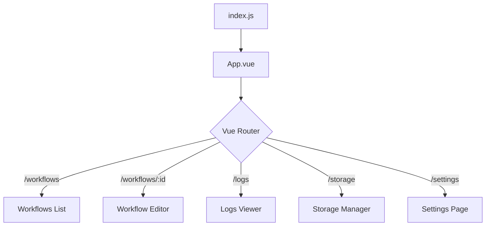

# UI Module Analysis

## Description
The UI of Automa is built with Vue.js 3 and TailwindCSS. It consists of two main applications: the Dashboard (`newtab`) and the Extension Popup (`popup`).

## Dashboard (`src/newtab`)

The Dashboard is the main interface where users create, manage, and view workflows. It is a full-page application.

### Entry Point
- **`src/newtab/index.js`**: Mounts the Vue app.
- **`src/newtab/App.vue`**: Root component.
- **`src/newtab/router.js`**: Defines the routing configuration.

### Key Pages
- **Workflows (`/workflows`)**: Lists all workflows.
    - Component: `src/newtab/pages/Workflows.vue`
- **Workflow Editor (`/workflows/:id`)**: The visual editor for workflows.
    - Component: `src/newtab/pages/workflows/[id].vue`
    - Uses `WorkflowEditor.vue` and `drawflow` library (wrapped).
- **Logs (`/logs`)**: Execution history.
    - Component: `src/newtab/pages/logs/[id].vue`
- **Storage (`/storage`)**: Manage variables, tables, and credentials.
    - Component: `src/newtab/pages/Storage.vue`
- **Settings (`/settings`)**: Global extension settings.

### State Management (Pinia)
Located in `src/stores/`.
- **`workflow.js`**: Manages the list of workflows.
- **`user.js`**: Manages user profile (if connected to Automa cloud).
- **`main.js`**: Global app settings (theme, locale).

## Popup (`src/popup`)

The Popup is the small window that appears when clicking the extension icon.

### Entry Point
- **`src/popup/index.js`**: Mounts the Popup app.
- **`src/popup/App.vue`**: Root component.

### Functionality
- **Quick Access**: Lists recent workflows.
- **Current Tab**: Shows workflows available for the current website.
- **Recording**: Start/Stop the workflow recorder.

## Component Architecture

The UI relies heavily on reusable components in `src/components`.
- **`ui/`**: Generic UI elements (Buttons, Inputs, Modals) styled with Tailwind.
- **`block/`**: Components representing blocks in the editor.
- **`newtab/`**: Components specific to the dashboard (e.g., `WorkflowEditor`, `LogsTable`).

## Routing Flow

