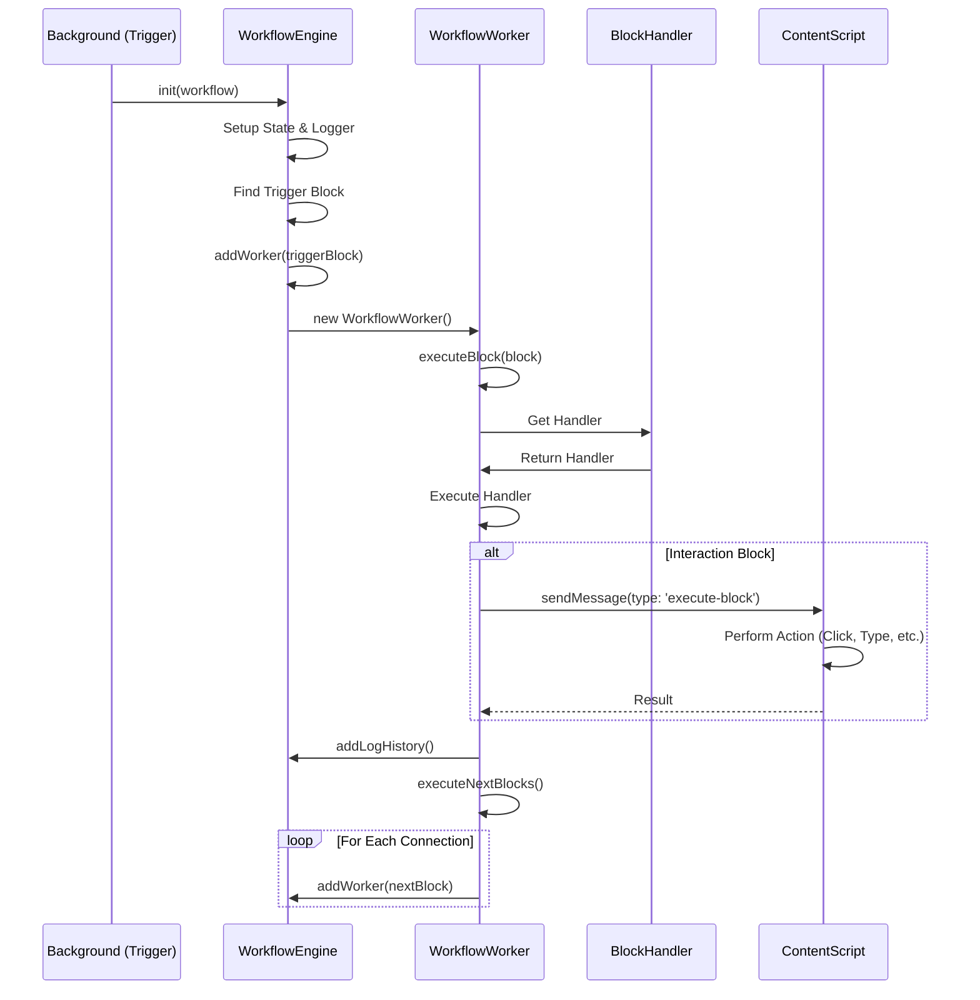

# Workflow Engine Analysis

## Description
The Workflow Engine is the core component responsible for executing automation workflows. It interprets the visual workflow graph (blocks and connections) and executes them sequentially or in parallel.

## Key Files

### `src/workflowEngine/WorkflowEngine.js`
The main class that orchestrates the execution of a workflow.
- **Responsibilities**:
    - Initializes the workflow state and logger.
    - Manages global data, variables, and tables.
    - Creates and manages `WorkflowWorker` instances.
    - Handles workflow lifecycle (start, stop, pause, resume).
    - Reports execution status and logs.

### `src/workflowEngine/WorkflowWorker.js`
Handles the execution of individual blocks within a workflow.
- **Responsibilities**:
    - Executes a specific block.
    - Determines the next block(s) to execute based on connections.
    - Manages block retries and error handling.
    - Communicates with the active tab (Content Script) for page interactions.
    - Handles loops and delays.

### `src/workflowEngine/blocksHandler.js`
A registry that dynamically imports all block handlers.
- **Mechanism**: Uses `require.context` to load all files in `blocksHandler/` directory.
- **Usage**: Maps block labels (e.g., `active-tab`) to their corresponding handler functions.

## Execution Flow

## Detailed Functionality

1.  **Initialization**:
    - `WorkflowEngine` is instantiated with the workflow JSON and options.
    - It validates the workflow (checks for trigger block, states).
    - It sets up initial variables and data columns.

2.  **Block Execution**:
    - `WorkflowEngine` delegates block execution to `WorkflowWorker`.
    - `WorkflowWorker` resolves the block handler from `blocksHandler.js`.
    - Templating is applied to replace variables (e.g., `{{ variable }}`) in block data.

3.  **Page Interaction**:
    - For blocks that require DOM interaction, `WorkflowWorker` sends a message to the active tab.
    - If the content script is not loaded, it attempts to inject it dynamically.

4.  **Flow Control**:
    - `WorkflowWorker` calculates the next blocks based on the output connections.
    - It handles special flows like Loops (`LoopData`, `LoopElements`) and Conditions.

5.  **Error Handling**:
    - Blocks can have "On Error" settings (Retry, Continue, specific output).
    - `WorkflowWorker` catches errors and applies these policies.
