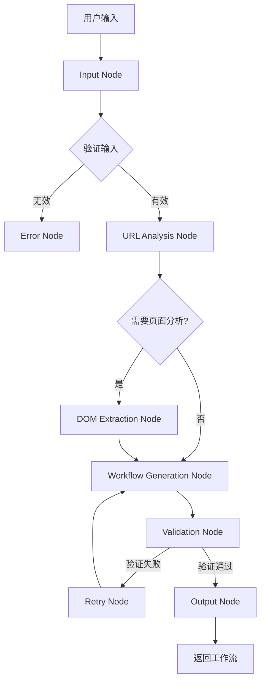

# AI 服务架构详解

Automa 集成了基于 Ollama 的本地大语言模型服务，支持 AI 驱动的工作流生成和智能对话。

## 架构概览

```
┌─────────────────────────────────────────────────────────────┐
│                      AI Service Layer                       │
│  ┌─────────────────────────────────────────────────────┐   │
│  │                  AIService.js                       │   │
│  │  (统一门面，封装所有 AI 调用)                        │   │
│  └─────────────────────────────────────────────────────┘   │
│                          │                                 │
│                          ▼                                 │
│  ┌─────────────────────────────────────────────────────┐   │
│  │                LangGraphAgent.js                    │   │
│  │  (基于 LangGraph 的复杂状态图智能体)                 │   │
│  │  - chat()      : 工作流生成                          │   │
│  │  - clearHistory(): 清除历史记录                       │   │
│  │  - initialize(): 初始化                              │   │
│  └─────────────────────────────────────────────────────┘   │
│                          │                                 │
│                          ▼                                 │
│  ┌─────────────────────────────────────────────────────┐   │
│  │             LangGraphService.js                     │   │
│  │  (LangGraph 服务核心)                                │   │
│  │  - run()         : 执行状态图                        │   │
│  │  - simpleChat()  : 简单聊天                          │   │
│  │  - simpleGenerate(): 简单生成                        │   │
│  └─────────────────────────────────────────────────────┘   │
│                          │                                 │
│          ┌───────────────┼───────────────┐                 │
│          ▼               ▼               ▼                 │
│  ┌─────────────┐ ┌─────────────┐ ┌─────────────────┐      │
│  │OllamaClient │ │WorkflowGen. │ │  Prompt Templates│     │
│  │(API 客户端)  │ │(工作流生成)  │ │   (提示词模板)    │      │
│  └─────────────┘ └─────────────┘ └─────────────────┘      │
└─────────────────────────────────────────────────────────────┘
```

## 核心组件

### 1. AIService.js

**文件**: `src/services/ai/AIService.js`

AI 服务的统一门面，所有 AI 调用都通过此服务。

```javascript
import LangGraphAgent from './LangGraphAgent.js';
import aiConfig from '../../config/ai.config.js';

class AIService {
  constructor() {
    this.langGraphAgent = null;
    this.initialized = false;
  }

  /**
   * 初始化 AI 服务
   * @param {Object} config - 配置对象
   * @returns {Promise<boolean>}
   */
  async initialize(config = {}) {
    this.langGraphAgent = new LangGraphAgent(config);
    const isHealthy = await this.langGraphAgent.initialize();
    
    if (!isHealthy) {
      throw new Error('Ollama 服务不可用,请确保 Ollama 已启动');
    }
    
    this.initialized = true;
    return true;
  }

  /**
   * 生成工作流 (通过 LangGraph 复杂状态图)
   */
  async generateWorkflow(userInput, targetUrl = '', onProgress, pageContext = null) {
    this.ensureInitialized();
    return await this.langGraphAgent.chat(userInput, targetUrl, onProgress, pageContext);
  }

  /**
   * 简单 AI 聊天
   */
  async chat(messages, options = {}) {
    const langGraphService = this.getLangGraphService();
    return await langGraphService.simpleChat(messages, options);
  }

  /**
   * 流式聊天
   */
  async chatStream(messages, onChunk, options = {}) {
    const langGraphService = this.getLangGraphService();
    return await langGraphService.simpleChatStream(messages, onChunk, options);
  }
}

const aiService = new AIService();
export default aiService;
```

#### 公开方法

| 方法 | 参数 | 返回 | 说明 |
|------|------|------|------|
| `initialize(config)` | 配置对象 | Promise<boolean> | 初始化服务 |
| `generateWorkflow(userInput, targetUrl, onProgress, pageContext)` | 用户输入、目标 URL、进度回调、页面上下文 | Promise<Object> | 生成工作流 |
| `chat(messages, options)` | 消息数组、可选配置 | Promise<Object> | 简单聊天 |
| `chatStream(messages, onChunk, options)` | 消息、回调、可选配置 | Promise<void> | 流式聊天 |
| `generate(prompt, options)` | 提示词、可选配置 | Promise<Object> | 简单生成 |
| `generateStream(prompt, onChunk, options)` | 提示词、回调、可选配置 | Promise<void> | 流式生成 |
| `checkHealth()` | 无 | Promise<boolean> | 健康检查 |
| `listModels()` | 无 | Promise<Array> | 列出可用模型 |
| `clearHistory()` | 无 | void | 清除历史记录 |

### 2. LangGraphAgent.js

**文件**: `src/services/ai/LangGraphAgent.js`

基于 LangGraph 的智能体，用于复杂的状态图管理和多轮对话。

```javascript
class LangGraphAgent {
  constructor(config = {}) {
    this.langGraphService = null;
    this.initialized = false;
    this.config = config;
  }

  /**
   * 初始化智能体
   * @returns {Promise<boolean>}
   */
  async initialize() {
    this.langGraphService = new LangGraphService(this.config);
    const isHealthy = await this.langGraphService.initialize();
    this.initialized = isHealthy;
    return isHealthy;
  }

  /**
   * 聊天/生成工作流
   * @param {string} userInput - 用户输入
   * @param {string} targetUrl - 目标 URL
   * @param {Function} onProgress - 进度回调
   * @param {string} pageContext - 页面上下文
   * @returns {Promise<Object>}
   */
  async chat(userInput, targetUrl = '', onProgress, pageContext = null) {
    return await this.langGraphService.run(userInput, targetUrl, onProgress, pageContext);
  }

  /**
   * 清除对话历史
   */
  clearHistory() {
    if (this.langGraphService) {
      this.langGraphService.clearHistory();
    }
  }
}
```

### 3. LangGraphService.js

**文件**: `src/services/ai/LangGraphService.js`

LangGraph 服务核心，处理状态图编排和节点执行。



#### 核心方法

| 方法 | 参数 | 返回 | 说明 |
|------|------|------|------|
| `initialize()` | 无 | Promise<boolean> | 初始化服务 |
| `run(userInput, targetUrl, onProgress, pageContext)` | 输入、URL、回调、上下文 | Promise<Object> | 执行状态图 |
| `simpleChat(messages, options)` | 消息、选项 | Promise<Object> | 简单聊天 |
| `simpleGenerate(prompt, options)` | 提示词、选项 | Promise<Object> | 简单生成 |
| `simpleChatStream(messages, onChunk, options)` | 消息、回调、选项 | Promise<void> | 流式聊天 |
| `simpleGenerateStream(prompt, onChunk, options)` | 提示词、回调、选项 | Promise<void> | 流式生成 |
| `clearHistory()` | 无 | void | 清除历史 |

### 4. OllamaClient.js

**文件**: `src/services/ai/OllamaClient.js`

Ollama API 客户端，处理与本地 Ollama 服务的通信。

```javascript
class OllamaClient {
  constructor(baseUrl = 'http://localhost:11434') {
    this.baseUrl = baseUrl;
    this.model = null;
  }

  /**
   * 初始化客户端
   * @param {Object} config - 配置
   * @returns {Promise<boolean>}
   */
  async initialize(config = {}) {
    this.baseUrl = config.baseUrl || this.baseUrl;
    this.model = config.model || 'llama3';
    
    // 健康检查
    const response = await fetch(`${this.baseUrl}/api/version`);
    return response.ok;
  }

  /**
   * 列出可用模型
   * @returns {Promise<Array>}
   */
  async listModels() {
    const response = await fetch(`${this.baseUrl}/api/tags`);
    const data = await response.json();
    return data.models || [];
  }

  /**
   * 生成响应
   * @param {Object} options - 选项
   * @returns {Promise<Object>}
   */
  async generate({ prompt, stream = false, ...options }) {
    const response = await fetch(`${this.baseUrl}/api/generate`, {
      method: 'POST',
      headers: { 'Content-Type': 'application/json' },
      body: JSON.stringify({
        model: this.model,
        prompt,
        stream,
        ...options,
      }),
    });
    
    if (stream) {
      return this._handleStreamResponse(response);
    }
    
    return response.json();
  }

  /**
   * 聊天响应
   * @param {Object} options - 选项
   * @returns {Promise<Object>}
   */
  async chat({ messages, stream = false, ...options }) {
    const response = await fetch(`${this.baseUrl}/api/chat`, {
      method: 'POST',
      headers: { 'Content-Type': 'application/json' },
      body: JSON.stringify({
        model: this.model,
        messages,
        stream,
        ...options,
      }),
    });
    
    if (stream) {
      return this._handleStreamResponse(response);
    }
    
    return response.json();
  }
}
```

### 5. WorkflowGenerator.js

**文件**: `src/services/ai/WorkflowGenerator.js`

基于 AI 的工作流生成器。

```javascript
class WorkflowGenerator {
  constructor() {
    this.ollama = null;
    this.systemPrompt = this._getSystemPrompt();
  }

  /**
   * 生成工作流
   * @param {string} userInput - 用户输入
   * @param {string} targetUrl - 目标 URL
   * @param {Function} onProgress - 进度回调
   * @returns {Promise<Object>}
   */
  async generate(userInput, targetUrl = '', onProgress) {
    const prompt = this._buildPrompt(userInput, targetUrl);
    
    const response = await this.ollama.generate({
      prompt,
      system: this.systemPrompt,
      format: 'json',
      options: {
        temperature: 0.1,
      },
    });
    
    return this._parseResponse(response);
  }

  /**
   * 分析页面并提取操作建议
   * @param {string} pageContent - 页面内容
   * @returns {Promise<Array>}
   */
  async analyzePage(pageContent) {
    const prompt = `分析以下页面内容，提取可自动化的操作：\n${pageContent}`;
    
    const response = await this.ollama.generate({
      prompt,
      format: 'json',
    });
    
    return JSON.parse(response.response);
  }
}
```

### 6. 提示词模板

**文件**: `src/services/ai/prompts/`

#### workflow-generation.js

工作流生成的系统提示词：

```javascript
export const workflowGenerationPrompt = `你是一个浏览器自动化工作流生成专家。

## 任务
根据用户描述生成 Automa 工作流 JSON。

## 输出格式
JSON 对象，包含以下字段：
- name: 工作流名称
- description: 描述
- drawflow: 工作流图数据
  - nodes: 节点数组
  - edges: 连接数组

## 节点类型
1. trigger: 触发器（ workflow-start、keyboard-shortcut、visit-web 等）
2. click: 点击元素
3. fill-input: 填写输入框
4. scroll: 滚动
5. wait: 等待
6. loop: 循环
7. condition: 条件判断
8. javascript: JavaScript 代码
9. extract-data: 提取数据

## 规则
1. 只使用必要的节点
2. 为每个交互提供选择器
3. 包含适当的延迟
4. 处理可能的错误

请直接输出 JSON，不要有其他内容。`;
```

#### interactive-mode.js

交互模式的提示词模板：

```javascript
export const interactivePrompt = `你是一个浏览器自动化助手。

## 交互模式
用户描述想要完成的自动化任务，你来生成并执行工作流。

## 可用能力
1. 生成工作流
2. 修改现有工作流
3. 分析页面结构
4. 提取页面数据

## 响应格式
请用中文回复，确认理解用户需求，并询问必要的细节。`;
```

---

## 配置

### AI 配置文件

**文件**: `src/config/ai.config.js`

```javascript
export default {
  // Ollama 服务配置
  ollama: {
    baseUrl: 'http://localhost:11434',  // Ollama 服务地址
    model: 'llama3',                     // 默认模型
    temperature: 0.1,                    // 生成温度
    contextSize: 4096,                   // 上下文大小
  },

  // LangGraph 配置
  langGraph: {
    maxIterations: 10,                   // 最大迭代次数
    checkpointInterval: 5,               // 检查点间隔
  },

  // 工作流生成配置
  workflow: {
    defaultTrigger: 'workflow-start',    // 默认触发器
    maxBlocks: 50,                       // 最大块数
    timeout: 30000,                      // 超时时间（毫秒）
  },
};
```

---

## 使用场景

### 1. 生成工作流

```javascript
import aiService from '@/services/ai/AIService';

// 在组件中
const handleGenerate = async () => {
  await aiService.initialize();
  
  const workflow = await aiService.generateWorkflow(
    '自动填写表单并提交',
    'https://example.com/form',
    (progress) => {
      console.log('进度:', progress);
    },
    pageSnapshot
  );
  
  // 保存生成的工作流
  await workflowStore.insert(workflow);
};
```

### 2. 简单聊天

```javascript
const messages = [
  { role: 'system', content: '你是一个助手。' },
  { role: 'user', content: '帮我生成一个点击按钮的工作流。' },
];

const response = await aiService.chat(messages);
console.log(response.message.content);
```

### 3. 流式输出

```javascript
const messages = [
  { role: 'user', content: '解释一下工作流引擎的架构。' }
];

await aiService.chatStream(
  messages,
  (chunk) => {
    // 处理每个文本块
    output.textContent += chunk.delta;
  },
  { temperature: 0.7 }
);
```

---

## 错误处理

```javascript
try {
  await aiService.initialize();
} catch (error) {
  if (error.message.includes('Ollama 服务不可用')) {
    // 提示用户启动 Ollama
    showNotification('请确保 Ollama 已启动', 'error');
  }
}

// 检查健康状态
const isHealthy = await aiService.checkHealth();
if (!isHealthy) {
  console.warn('AI 服务不可用');
}
```

---

## 模型配置

### 推荐模型

| 模型 | 参数量 | 适用场景 |
|------|--------|----------|
| llama3 | 8B | 通用对话、工作流生成 |
| codellama | 7B | 代码生成 |
| mistral | 7B | 轻量级任务 |
| qwen | 7B | 中英文混合 |

### 模型切换

```javascript
await aiService.updateConfig({
  ollama: {
    baseUrl: 'http://localhost:11434',
    model: 'qwen:7b',
  },
});
```

---

## 性能优化

### 1. 连接池

```javascript
// OllamaClient.js
class OllamaClient {
  constructor() {
    this.pendingRequests = [];
    this.maxConcurrent = 3;
  }

  async enqueue(request) {
    if (this.pendingRequests.length >= this.maxConcurrent) {
      await new Promise(resolve => {
        this.pendingRequests.push(resolve);
      });
    }
    // 执行请求...
  }
}
```

### 2. 响应缓存

```javascript
class OllamaClient {
  constructor() {
    this.cache = new Map();
  }

  async generate(options) {
    const key = JSON.stringify(options);
    
    if (this.cache.has(key)) {
      return this.cache.get(key);
    }
    
    const result = await this._fetch(options);
    this.cache.set(key, result);
    return result;
  }
}
```

---

## 监控指标

```javascript
const metrics = aiService.getMetrics();

console.log({
  totalRequests: metrics.totalRequests,
  avgResponseTime: metrics.avgResponseTime,
  cacheHitRate: metrics.cacheHitRate,
});
```
