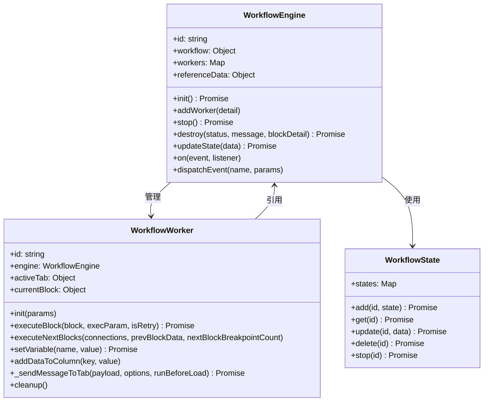
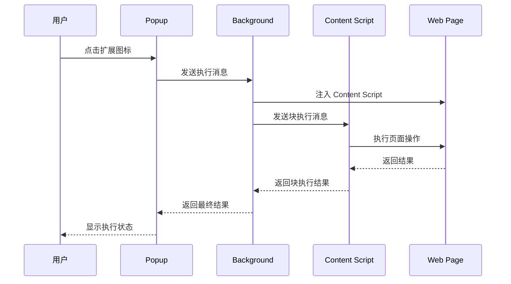
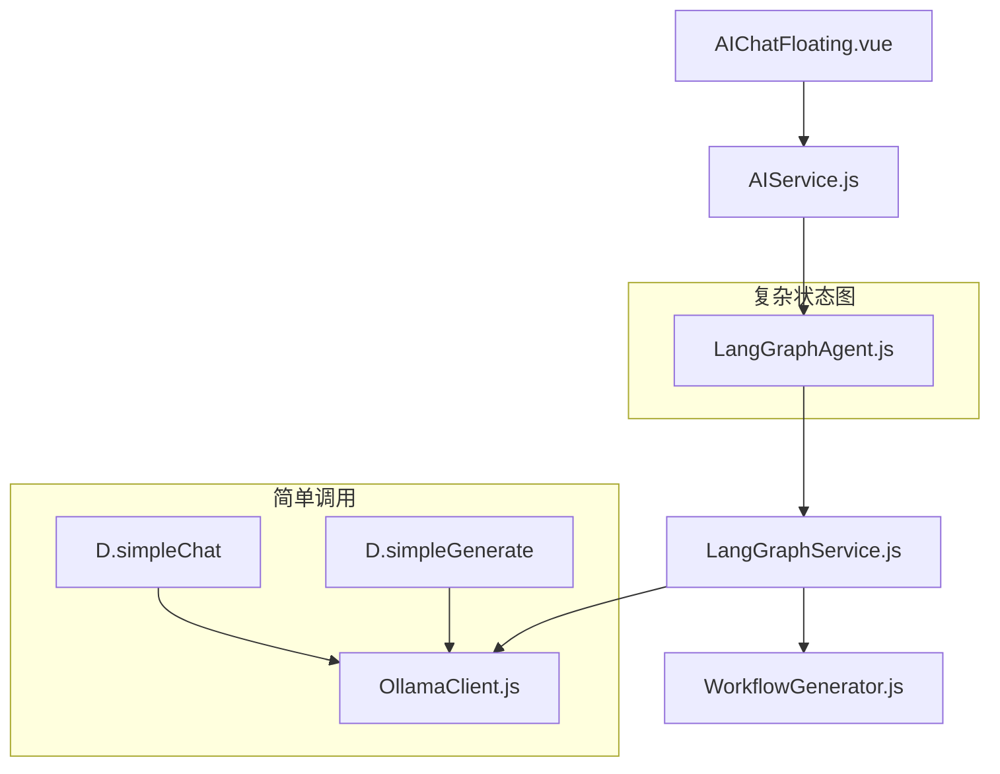
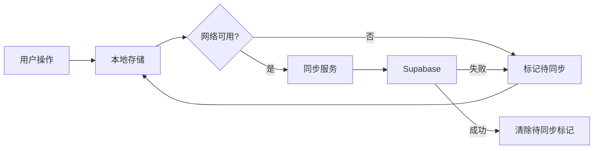
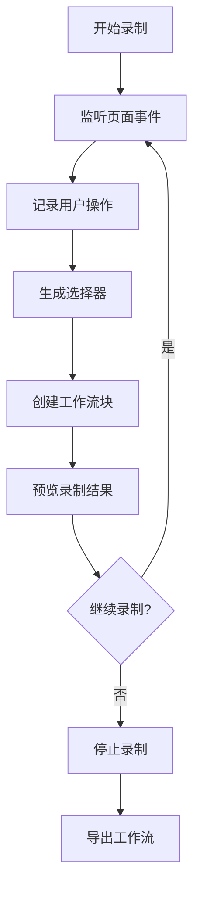

# Automa 浏览器扩展架构设计

## 项目概述

Automa 是一个基于浏览器扩展的工作流自动化平台，支持通过可视化界面创建和执行浏览器自动化任务。该项目采用 **Manifest V3** 标准构建，支持 Chrome 和 Firefox 浏览器。

**核心特性：**
- 可视化工作流编辑器（基于 Drawflow）
- 无代码/低代码自动化
- AI 驱动的工作流生成（Ollama/LangGraph 集成）
- 工作流触发器（定时、快捷键、右键菜单等）
- 强大的数据处理和表格管理
- 离线优先的数据同步机制

---

## 项目结构

```
src/
├── assets/                  # 静态资源
├── background/              # 后台服务脚本
│   ├── index.js             # 后台主入口
│   ├── BackgroundEventsListeners.js  # 事件监听器
│   ├── BackgroundWorkflowTriggers.js # 工作流触发器管理
│   └── BackgroundWorkflowUtils.js    # 工作流工具函数
├── common/                  # 公共常量和工具
├── components/              # Vue 组件库
│   ├── block/               # 工作流块组件
│   ├── newtab/              # 新标签页组件
│   ├── popup/               # 弹出窗口组件
│   └── ui/                  # UI 基础组件
├── composable/              # Vue Composables
├── config/                  # 配置文件
├── content/                 # 内容脚本
│   ├── blocksHandler.js     # 页面交互处理器
│   ├── elementSelector/     # 元素选择器
│   ├── commandPalette/      # 命令面板
│   └── services/recordWorkflow/  # 工作流录制
├── db/                      # Dexie.js 数据库
├── directives/              # Vue 指令
├── execute/                 # 执行相关工具
├── lib/                     # 第三方库封装
├── locales/                 # 国际化文件
├── newtab/                  # 新标签页（仪表板）
│   ├── pages/               # 页面组件
│   └── utils/               # 工具函数
├── offscreen/               # Offscreen 文档
├── params/                  # 参数输入页面
├── popup/                   # 弹出窗口
├── sandbox/                 # 沙箱页面
├── service/                 # 浏览器 API 服务
├── services/                # 业务服务
│   ├── ai/                  # AI 服务
│   │   ├── AIService.js            # AI 统一门面
│   │   ├── LangGraphAgent.js       # LangGraph 智能体
│   │   ├── LangGraphService.js     # LangGraph 服务核心
│   │   ├── OllamaClient.js         # Ollama 客户端
│   │   └── WorkflowGenerator.js    # 工作流生成器
│   ├── supabase/            # Supabase 服务
│   └── workflowSync/        # 工作流同步服务
├── stores/                  # Pinia 状态管理
├── utils/                   # 工具函数
├── workflowEngine/          # 工作流引擎核心
│   ├── WorkflowEngine.js    # 工作流引擎主类
│   ├── WorkflowWorker.js    # 工作者类
│   ├── WorkflowManager.js   # 工作流管理器
│   ├── WorkflowState.js     # 状态管理
│   ├── WorkflowLogger.js    # 日志记录
│   ├── blocksHandler/       # 块处理器
│   └── templating/          # 模板引擎
└── manifest.*.json          # 扩展清单文件
```

---

## 核心架构

### 1. 工作流引擎 (Workflow Engine)

工作流引擎是 Automa 的核心组件，负责解析和执行工作流。



### 2. 工作流块类型 (Block Categories)

工作流由多种类型的块组成：

| 类别 | 描述 | 示例 |
|------|------|------|
| **trigger** | 触发器块，工作流入口 | 定时触发、快捷键、右键菜单、页面访问 |
| **interaction** | 页面交互块 | 点击、输入、滚动、表单操作 |
| **browser** | 浏览器控制块 | 新标签页、关闭标签页、切换标签页 |
| **data** | 数据处理块 | 循环数据、插入数据、数据映射 |
| **loop** | 循环控制块 | 循环元素、While 循环、中断 |
| **control** | 流程控制块 | 条件判断、延迟、异常处理 |
| **advanced** | 高级块 | JavaScript 代码、Webhook、AI 工作流 |
| **storage** | 存储块 | Cookie 操作、存储数据 |
| **event** | 事件块 | 触发事件、等待连接 |
| **package** | 包块 | 复用工作流块 |

### 3. 通信架构



---

## 关键模块详解

### 1. 工作流触发器 (Triggers)

Automa 支持多种触发方式来启动工作流：

```javascript
// src/utils/workflowTrigger.js
const workflowTriggersMap = {
  interval: registerInterval,           // 定时触发
  date: registerSpecificDate,           // 指定日期
  'cron-job': registerCronJob,          // Cron 表达式
  'visit-web': registerVisitWeb,        // 访问网页时
  'on-startup': registerOnStartup,      // 启动时
  'specific-day': registerSpecificDay,  // 特定日期
  'context-menu': registerContextMenu,  // 右键菜单
  'keyboard-shortcut': registerKeyboardShortcut  // 键盘快捷键
};
```

### 2. AI 服务架构

AI 服务采用分层架构设计：



**核心服务：**
- **AIService**: 统一门面，封装所有 AI 调用
- **LangGraphAgent**: 基于 LangGraph 的智能体，支持复杂状态图
- **LangGraphService**: LangGraph 服务核心，处理状态管理和节点执行
- **OllamaClient**: Ollama API 客户端，支持流式和非流式调用
- **WorkflowGenerator**: 基于 AI 的工作流生成器

### 3. 数据存储

Automa 使用 Dexie.js（IndexedDB 封装）进行本地存储：

```javascript
// src/db/storage.js
import Dexie from 'dexie';

const dbStorage = new Dexie('storage');
dbStorage.version(2).stores({
  tablesData: '++id, tableId',      // 表格数据
  tablesItems: '++id, name, createdAt, modifiedAt',  // 表格项
  variables: '++id, &name',         // 变量（唯一 name）
  credentials: '++id, &name',       # 凭证（敏感信息）
});
```

### 4. 状态管理 (Pinia Stores)

| Store | 职责 |
|-------|------|
| `workflow` | 工作流 CRUD、状态、同步 |
| `folder` | 文件夹管理 |
| `user` | 用户认证、信息 |
| `teamWorkflow` | 团队工作流 |
| `hostedWorkflow` | 托管工作流 |
| `sharedWorkflow` | 共享工作流 |
| `package` | 块包管理 |
| `main` | 全局设置 |

---

## 权限配置

### Manifest 权限

```json
// src/manifest.chrome.json
{
  "permissions": [
    "cookies",           // Cookie 操作
    "tabs",              // 标签页管理
    "proxy",             // 代理设置
    "alarms",            // 定时任务
    "storage",           // 存储
    "debugger",          // 调试模式
    "activeTab",         // 当前活动标签页
    "offscreen",         # Offscreen 文档
    "downloads",         # 下载管理
    "webNavigation",     # 网页导航
    "unlimitedStorage",  # 无限存储
    "scripting"          # 脚本注入
  ],
  "optional_permissions": [
    "contextMenus",      # 右键菜单
    "clipboardRead",     # 剪贴板读取
    "notifications"      # 通知
  ],
  "host_permissions": ["<all_urls>"]  # 所有 URL 访问
}
```

---

## 离线优先同步

Automa 采用离线优先的同步策略：



**同步服务** (`src/services/workflowSync/WorkflowSyncService.js`)：
- 记录所有待同步操作（upsert/delete）
- 网络恢复后自动同步
- 支持冲突解决

---

## 页面交互处理

Content Script 通过消息传递与 Background 通信：

```javascript
// src/content/index.js
async function executeBlock(data) {
  const handlers = blocksHandler();
  const handler = handlers[toCamelCase(data.name || data.label)];
  if (handler) {
    const result = await handler(data, { handleSelector });
    return result;
  }
  throw new Error(`"${data.label}" doesn't have a handler`);
}
```

支持的页面操作包括：
- 点击元素 (`handlerEventClick`)
- 填写表单 (`handlerForms`)
- 获取文本 (`handlerGetText`)
- 触发事件 (`handlerTriggerEvent`)
- 截图 (`handlerTakeScreenshot`)
- 等待元素 (`handlerElementExists`)
- 循环元素 (`handlerLoopElements`)
- JavaScript 代码执行 (`handlerJavascriptCode`)

---

## 工作流录制

Automa 提供可视化的工作流录制功能：



---

## 扩展入口点

| 入口 | 文件 | 说明 |
|------|------|------|
| Popup | `src/popup/` | 快速启动工作流 |
| 新标签页 | `src/newtab/` | 完整仪表板 |
| 参数页面 | `src/params/` | 工作流参数输入 |
| 内容脚本 | `src/content/` | 页面交互执行 |
| 后台脚本 | `src/background/` | 全局事件处理 |
| Sandbox | `src/sandbox/` | 沙箱执行环境 |

---

## 开发注意事项

1. **内存管理**: 使用 `cleanup()` 方法释放资源
2. **错误处理**: 块执行支持重试和错误数据插入
3. **CSP 绕过**: 通过 Debugger API 绕过严格 CSP
4. **国际化**: 支持多语言，资源文件在 `locales/`
5. **主题适配**: 支持亮色/暗色主题
