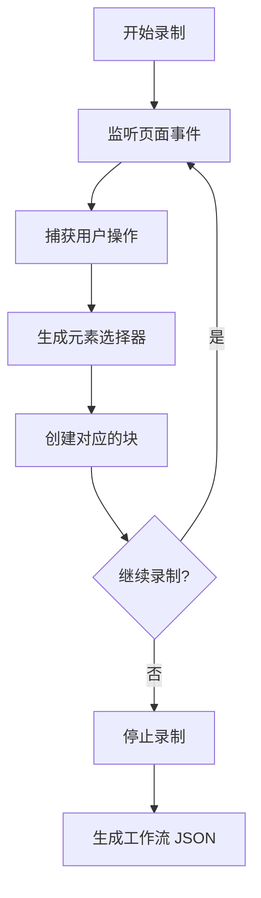

# 内容脚本 (Content Script) 详解

内容脚本是 Automa 在网页上下文中运行的核心组件，负责执行页面交互操作、元素选择和事件监听。

## 概述

内容脚本在每个网页的渲染进程中运行，可以直接访问和操作 DOM，是工作流引擎与网页交互的桥梁。

```json
// manifest.chrome.json
{
  "content_scripts": [
    {
      "matches": ["<all_urls>"],
      "js": ["contentScript.bundle.js"],
      "run_at": "document_start",
      "match_about_blank": true,
      "all_frames": true
    }
  ]
}
```

---

## 核心职责

1. **执行页面交互** - 点击、输入、滚动等 DOM 操作
2. **元素选择** - 生成可靠的元素选择器
3. **事件录制** - 记录用户操作用于工作流生成
4. **命令面板** - 提供快捷命令功能
5. **上下文菜单** - 处理右键菜单交互

---

## 目录结构

```
src/content/
├── index.js                    # 主入口
├── blocksHandler.js            # 块处理器路由
├── elementObserver.js          # 元素变化观察者
├── handleSelector.js           # 元素选择器处理
├── injectAppStyles.js          # 注入应用样式
├── showExecutedBlock.js        # 显示执行的块
├── synchronizedLock.js         # 同步锁
├── utils.js                    # 工具函数
├── blocksHandler/              # 页面交互块处理器
│   ├── handlerAttributeValue.js    # 属性值操作
│   ├── handlerClipboard.js         # 剪贴板
│   ├── handlerConditions.js        # 条件判断
│   ├── handlerCreateElement.js     # 创建元素
│   ├── handlerElementExists.js     # 元素存在检查
│   ├── handlerElementScroll.js     # 元素滚动
│   ├── handlerEventClick.js        # 点击事件
│   ├── handlerForms.js             # 表单操作
│   ├── handlerGetText.js           # 获取文本
│   ├── handlerHoverElement.js      # 悬停元素
│   ├── handlerJavascriptCode.js    # JavaScript 代码
│   ├── handlerLink.js              # 链接操作
│   ├── handlerLoopData.js          # 循环数据
│   ├── handlerLoopElements.js      # 循环元素
│   ├── handlerPressKey.js          # 按键操作
│   ├── handlerSaveAssets.js        # 保存资源
│   ├── handlerSwitchTo.js          # 切换框架
│   ├── handlerTakeScreenshot.js    # 截图
│   ├── handlerTriggerEvent.js      # 触发事件
│   └── handlerUploadFile.js        # 文件上传
├── elementSelector/            # 元素选择器
│   ├── App.vue                 # 选择器 UI
│   ├── compsUi.js              # UI 组件
│   ├── generateElementsSelector.js  # 生成选择器
│   ├── getSelectorOptions.js   # 获取选项
│   ├── icons.js                # 图标
│   ├── index.js                # 入口
│   ├── listSelector.js         # 列表选择器
│   ├── main.js                 # 主逻辑
│   ├── selectorFrameContext.js # 框架上下文
│   └── vueI18n.js              # 国际化
├── commandPalette/             # 命令面板
│   ├── App.vue                 # 命令面板 UI
│   ├── compsUi.js              # UI 组件
│   ├── icons.js                # 图标
│   ├── index.js                # 入口
│   └── main.js                 # 主逻辑
└── services/                   # 服务
    ├── recordWorkflow/         # 工作流录制
    │   ├── App.vue             # 录制 UI
    │   ├── addBlock.js         # 添加块
    │   ├── icons.js            # 图标
    │   ├── index.js            # 入口
    │   ├── main.js             # 主逻辑
    │   └── recordEvents.js     # 事件录制
    ├── shortcutListener.js     # 快捷键监听
    └── webService.js           # Web 服务
```

---

## 主入口 (index.js)

### 初始化流程

```javascript
// src/content/index.js

(() => {
  if (window.isAutomaInjected) return;
  
  window.isAutomaInjected = true;
  
  // 初始化命令面板
  initCommandPalette();
  
  // 初始化快捷键监听
  if (isMainFrame) {
    shortcutListener();
  }
  
  // 初始化业务模块
  automa('content');
  
  // 注册消息监听器
  browser.runtime.onMessage.addListener(async (data) => {
    // 处理各类消息
  });
})();
```

### 消息处理

```javascript
browser.runtime.onMessage.addListener(async (data) => {
  if (data.isBlock) {
    // 执行块
    return asyncExecuteBlock(data);
  }
  
  switch (data.type) {
    case 'input-workflow-params':
      // 输入工作流参数
      window.initPaletteParams?.(data.data);
      return Boolean(window.initPaletteParams);
      
    case 'content-script-exists':
      // 检查内容脚本是否存在
      return true;
      
    case 'automa-element-selector':
      // 元素选择器
      return elementSelectorInstance();
      
    case 'context-element':
      // 获取上下文元素
      return getContextElement();
      
    default:
      return null;
  }
});
```

### 块执行

```javascript
async function executeBlock(data) {
  const removeExecutedBlock = showExecutedBlock(data, data.executedBlockOnWeb);
  
  // 处理 iframe
  if (data.data?.selector?.includes('|>')) {
    const frameElement = await getFrameElement(data.data.selector);
    // 在框架中执行...
  }
  
  const handlers = blocksHandler();
  const handler = handlers[toCamelCase(data.name || data.label)];
  
  if (handler) {
    const result = await handler(data, { handleSelector });
    removeExecutedBlock();
    return result;
  }
  
  throw new Error(`"${data.label}" doesn't have a handler`);
}
```

---

## 块处理器 (Blocks Handler)

### 点击事件处理器

```javascript
// src/content/blocksHandler/handlerEventClick.js

export default function handlerEventClick(block) {
  const { selector, clickType, waitForSelector, delay, mouseButton } = block.data;
  
  return new Promise(async (resolve, reject) => {
    try {
      // 等待元素
      const element = await queryElements({
        selector,
        waitForSelector: waitForSelector || 0,
        multiple: false,
      });
      
      // 延迟点击
      if (delay > 0) await sleep(delay);
      
      // 执行点击
      switch (clickType) {
        case 'click':
          element.click();
          break;
        case 'double-click':
          element.dispatchEvent(new MouseEvent('dblclick', {
            bubbles: true,
            cancelable: true,
            view: window,
            button: mouseButton || 0,
          }));
          break;
        case 'middle-click':
          element.dispatchEvent(new MouseEvent('click', {
            bubbles: true,
            cancelable: true,
            view: window,
            button: 1,
          }));
          break;
      }
      
      resolve({ data: '', nextBlockId: getBlockConnections(block.id) });
    } catch (error) {
      reject(error);
    }
  });
}
```

### 表单处理器

```javascript
// src/content/blocksHandler/handlerForms.js

export default function handlerForms(block) {
  const { selector, action, value, clearBefore, checkChoose } = block.data;
  
  return new Promise(async (resolve, reject) => {
    try {
      const element = await queryElements({
        selector,
        multiple: false,
      });
      
      switch (action) {
        case 'type':
          if (clearBefore) element.value = '';
          // 支持模板变量
          element.value = await renderString(value, block.refData);
          element.dispatchEvent(new Event('input', { bubbles: true }));
          element.dispatchEvent(new Event('change', { bubbles: true }));
          break;
          
        case 'check':
          if (element.checked !== checkChoose) {
            element.click();
          }
          break;
          
        case 'select':
          const option = Array.from(element.options).find(
            opt => opt.value === value || opt.textContent === value
          );
          if (option) {
            element.value = option.value;
            element.dispatchEvent(new Event('change', { bubbles: true }));
          }
          break;
      }
      
      resolve({ data: '', nextBlockId: getBlockConnections(block.id) });
    } catch (error) {
      reject(error);
    }
  });
}
```

### 获取文本处理器

```javascript
// src/content/blocksHandler/handlerGetText.js

export default function handlerGetText(block) {
  const { selector, elementType, attribute, splitBy, splitIndex } = block.data;
  
  return new Promise(async (resolve, reject) => {
    try {
      const elements = await queryElements({
        selector,
        multiple: true,
      });
      
      let result;
      
      switch (elementType) {
        case 'text':
          result = Array.from(elements).map(el => el.textContent.trim());
          break;
          
        case 'attribute':
          result = Array.from(elements).map(el => el.getAttribute(attribute));
          break;
          
        case 'href':
          result = Array.from(elements).map(el => el.href);
          break;
          
        case 'src':
          result = Array.from(elements).map(el => el.src);
          break;
          
        case 'innerHTML':
          result = Array.from(elements).map(el => el.innerHTML);
          break;
      }
      
      // 处理分割
      if (splitBy && result.length === 1) {
        const parts = result[0].split(splitBy);
        result = splitIndex !== undefined ? parts[splitIndex] : parts;
      }
      
      resolve({
        data: result,
        nextBlockId: getBlockConnections(block.id)
      });
    } catch (error) {
      reject(error);
    }
  });
}
```

### 触发事件处理器

```javascript
// src/content/blocksHandler/handlerTriggerEvent.js

export default function handlerTriggerEvent(block) {
  const { selector, eventName, bubbles, cancelable } = block.data;
  
  return new Promise(async (resolve, reject) => {
    try {
      const elements = await queryElements({
        selector,
        multiple: true,
      });
      
      const event = new Event(eventName, {
        bubbles: bubbles ?? true,
        cancelable: cancelable ?? true,
      });
      
      Array.from(elements).forEach(el => el.dispatchEvent(event));
      
      resolve({ data: '', nextBlockId: getBlockConnections(block.id) });
    } catch (error) {
      reject(error);
    }
  });
}
```

### 截图处理器

```javascript
// src/content/blocksHandler/handlerTakeScreenshot.js

export default function handlerTakeScreenshot(block) {
  const { fullPage, selector, format, quality } = block.data;
  
  return new Promise(async (resolve, reject) => {
    try {
      let dataUrl;
      
      if (fullPage) {
        // 整页截图
        dataUrl = await captureFullPage();
      } else if (selector) {
        // 元素截图
        const element = await queryElements({
          selector,
          multiple: false,
        });
        dataUrl = await captureElement(element);
      } else {
        // 视口截图
        dataUrl = await captureViewport();
      }
      
      // 转换为 base64
      const base64 = dataUrl.split(',')[1];
      
      resolve({
        data: base64,
        nextBlockId: getBlockConnections(block.id)
      });
    } catch (error) {
      reject(error);
    }
  });
}
```

### 循环元素处理器

```javascript
// src/content/blocksHandler/handlerLoopElements.js

export default function handlerLoopElements(block, { refData }) {
  const { selector, outputName, behavior } = block.data;
  
  return new Promise(async (resolve, reject) => {
    try {
      const elements = await queryElements({
        selector,
        multiple: true,
      });
      
      const elementArray = Array.from(elements);
      const loopData = {};
      
      if (behavior === 'array') {
        // 作为数组返回
        refData.loopData[outputName] = elementArray;
      } else {
        // 逐个处理
        elementArray.forEach((el, index) => {
          loopData[`${outputName}${index}`] = el;
        });
        refData.loopData = loopData;
      }
      
      resolve({
        data: elementArray,
        nextBlockId: getBlockConnections(block.id),
        replacedValue: { loopData: refData.loopData }
      });
    } catch (error) {
      reject(error);
    }
  });
}
```

---

## 元素选择器

### 选择器生成

```javascript
// src/content/elementSelector/generateElementsSelector.js

import findSelector from '@/lib/findSelector';

export function generateElementsSelector(elements, options = {}) {
  const selectors = [];
  
  elements.forEach(element => {
    const selector = findSelector(element, {
      attr: options.attr || ['id', 'class', 'name', 'data-testid'],
      prefix: options.prefix || '',
      original: options.original || false,
    });
    
    selectors.push({
      element,
      selector,
      tagName: element.tagName.toLowerCase(),
      text: element.textContent?.trim().slice(0, 50),
    });
  });
  
  return selectors;
}
```

### 选择器优先级

1. **ID 选择器** - `#element-id`
2. **唯一属性** - `[data-testid="value"]`
3. **类名组合** - `.class1.class2`
4. **标签+类** - `div.container`
5. **XPath 备用** - 当 CSS 选择器不可靠时

### 选择器验证

```javascript
// src/content/blocksHandler/handlerVerifySelector.js

export default function handlerVerifySelector(block) {
  const { selector, findBy } = block.data;
  
  return new Promise(async (resolve, reject) => {
    try {
      const documentCtx = getDocumentCtx();
      const elements = await queryElements({
        selector,
        findBy: findBy || 'cssSelector',
        multiple: true,
      }, documentCtx);
      
      const exists = elements && elements.length > 0;
      
      resolve({
        data: exists,
        nextBlockId: getBlockConnections(block.id, exists ? 1 : 2)
      });
    } catch (error) {
      reject(error);
    }
  });
}
```

---

## 命令面板

### 初始化

```javascript
// src/content/commandPalette/index.js

function initCommandPalette() {
  // 创建命令面板容器
  const container = document.createElement('div');
  container.id = 'automa-command-palette';
  document.body.appendChild(container);
  
  // 挂载 Vue 应用
  const app = createApp(CommandPaletteApp);
  app.mount(container);
}
```

### 功能

- **快速执行** - 输入命令快速执行操作
- **搜索工作流** - 搜索并运行工作流
- **插入块** - 在工作流编辑器中插入块
- **参数输入** - 输入工作流参数

---

## 工作流录制

### 录制流程



### 事件监听

```javascript
// src/content/services/recordWorkflow/recordEvents.js

export function startRecording(options = {}) {
  const handlers = {
    click: handleClick,
    input: handleInput,
    scroll: handleScroll,
    keydown: handleKeydown,
  };
  
  // 注册事件监听器
  Object.entries(handlers).forEach(([event, handler]) => {
    document.addEventListener(event, handler, { capture: true });
  });
  
  // 保存选择器
  const recordedBlocks = [];
  
  function handleClick(event) {
    if (options.excludeAutoma) {
      if (event.target.closest('#automa-command-palette')) return;
    }
    
    const selector = findSelector(event.target);
    
    recordedBlocks.push({
      type: 'click',
      selector,
      timestamp: Date.now(),
    });
  }
  
  function handleInput(event) {
    const selector = findSelector(event.target);
    
    recordedBlocks.push({
      type: 'fill-input',
      selector,
      value: event.target.value,
      timestamp: Date.now(),
    });
  }
  
  return () => {
    // 清理监听器
    Object.entries(handlers).forEach(([event, handler]) => {
      document.removeEventListener(event, handler, { capture: true });
    });
  };
}
```

---

## 快捷键监听

```javascript
// src/content/services/shortcutListener.js

export default function shortcutListener() {
  const shortcuts = {
    'Alt+P': () => openElementSelector(),
    'Alt+A': () => openDashboard(),
    'Alt+R': () => startRecording(),
    'Alt+Escape': () => stopRecording(),
  };
  
  document.addEventListener('keydown', (event) => {
    const key = [];
    
    if (event.altKey) key.push('Alt');
    if (event.ctrlKey) key.push('Control');
    if (event.shiftKey) key.push('Shift');
    if (event.metaKey) key.push('Meta');
    
    key.push(event.key);
    
    const shortcutKey = key.join('+');
    
    if (shortcuts[shortcutKey]) {
      event.preventDefault();
      shortcuts[shortcutKey]();
    }
  });
}
```

---

## 上下文菜单

```javascript
// src/content/index.js

let contextElement = null;
let $ctxLink = '';
let $ctxMediaUrl = '';
let $ctxTextSelection = '';

window.addEventListener('contextmenu', ({ target }) => {
  contextElement = target;
  $ctxTextSelection = window.getSelection().toString();
  
  // 获取链接
  if (target.tagName === 'A') {
    $ctxLink = target.href;
  } else {
    const closestUrl = target.closest('a');
    if (closestUrl) $ctxLink = closestUrl.href;
  }
  
  // 获取媒体 URL
  const mediaTags = ['AUDIO', 'VIDEO', 'IMG'];
  if (mediaTags.includes(target.tagName)) {
    $ctxMediaUrl = target.src || '';
  }
});
```

---

## 与后台通信

### 发送消息

```javascript
// 通过 CustomEvent 发送到后台
window.dispatchEvent(new CustomEvent('__automa-fetch__', {
  detail: {
    id: nanoid(),
    type: 'json',
    resource: { url: 'https://api.example.com/data' },
  },
}));

// 监听响应
window.addEventListener(`__automa-fetch-response-${id}__`, (event) => {
  if (event.detail.isError) {
    console.error(event.detail.result);
  } else {
    console.log(event.detail.result);
  }
});
```

### 接收消息

```javascript
browser.runtime.onMessage.addListener(async (data, sender) => {
  if (data.type === 'automa:execute-block') {
    return executeBlock(data.blockData);
  }
  
  if (data.type === 'context-element') {
    return {
      $ctxElSelector: findSelector(contextElement),
      $ctxTextSelection,
      $ctxLink,
      $ctxMediaUrl,
    };
  }
});
```

---

## 性能优化

### 1. 事件防抖

```javascript
function debounce(func, wait) {
  let timeout;
  return function executedFunction(...args) {
    const later = () => {
      clearTimeout(timeout);
      func(...args);
    };
    clearTimeout(timeout);
    timeout = setTimeout(later, wait);
  };
}
```

### 2. 选择器缓存

```javascript
const selectorCache = new Map();

function getCachedSelector(element) {
  if (selectorCache.has(element)) {
    return selectorCache.get(element);
  }
  
  const selector = findSelector(element);
  selectorCache.set(element, selector);
  return selector;
}
```

### 3. 批量操作

```javascript
// 使用 DocumentFragment 批量添加元素
const fragment = document.createDocumentFragment();
elements.forEach(el => {
  fragment.appendChild(el.cloneNode(true));
});
document.body.appendChild(fragment);
```

---

## 安全考虑

### 1. CSP 绕过

当页面启用了严格的 Content Security Policy 时，使用 Debugger API 执行脚本：

```javascript
// 在 background 中处理
browser.debugger.attach({ tabId }, '1.3', () => {
  browser.debugger.sendCommand(
    { tabId },
    'Runtime.evaluate',
    { expression: userCode },
    (result) => {
      // 处理结果
      browser.debugger.detach({ tabId });
    }
  );
});
```

### 2. XSS 防护

```javascript
// 使用 trustedTypes 或 DOMPurify 清理输入
import DOMPurify from 'dompurify';

function sanitizeHTML(html) {
  return DOMPurify.sanitize(html, {
    ALLOWED_TAGS: ['b', 'i', 'em', 'strong', 'a'],
    ALLOWED_ATTR: ['href', 'target'],
  });
}
```

---

## 调试技巧

### 1. 查看注入状态

```javascript
console.log({
  isAutomaInjected: window.isAutomaInjected,
  automaRefData: window.automaRefData,
});
```

### 2. 手动触发录制

```javascript
// 在控制台执行
window.startAutomaRecording();
```

### 3. 测试选择器

```javascript
// 测试选择器是否正确
const elements = document.querySelectorAll('.your-selector');
console.log(`Found ${elements.length} elements`);
```
