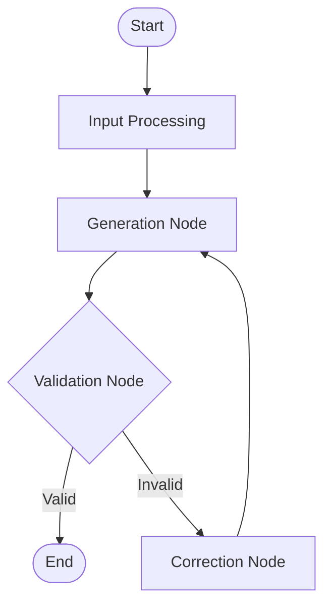

# LangGraph & Ollama Integration Guide

## Overview
This module integrates **LangGraph** framework with **Ollama** to provide robust, stateful AI workflow generation for Automa. It replaces the simple linear generation logic with a graph-based approach that supports validation loops, error correction, and context awareness.

## Architecture

### Components
1.  **LangGraphService (`src/services/ai/LangGraphService.js`)**:
    -   **StateGraph**: Manages the flow of the generation process.
    -   **Nodes**:
        -   `input_processing`: Prepares prompts and context.
        -   `generation`: Calls Ollama API.
        -   `validation`: Validates output JSON and Workflow structure.
        -   `correction`: Generates error messages for retry.
    -   **Edges**: Defines logic flow (e.g., if invalid -> correction -> generation).

2.  **OllamaClient (`src/services/ai/OllamaClient.js`)**:
    -   Enhanced HTTP client.
    -   **Features**:
        -   Background Proxy (bypass CORS).
        -   In-memory Caching.
        -   Metrics (latency, errors).
        -   Batch Generation support.

3.  **LangGraphAgent (`src/services/ai/LangGraphAgent.js`)**:
    -   Frontend-facing facade.
    -   Manages chat session history.
    -   Delegates heavy lifting to `LangGraphService`.

### Flow Diagram


## Configuration

### Ollama Setup
Use the provided Docker Compose file to start Ollama with CORS enabled.

```bash
cd deploy
docker-compose up -d
```

### Environment Variables (Client)
Configure in `src/config/ai.config.js` or via UI settings.
- `baseUrl`: Ollama API URL (default: `http://localhost:11434`)
- `model`: Model name (e.g., `mistral`, `llama3`)

## Usage Example

```javascript
import LangGraphAgent from '@/services/ai/LangGraphAgent';

const agent = new LangGraphAgent();
await agent.initialize();

const result = await agent.chat('Create a workflow to scrape Google');

if (result.success) {
    console.log('Workflow:', result.workflow);
}
```

## Monitoring & Metrics
Access metrics via `agent.ollama.getMetrics()`:
- `requests`: Total API calls
- `errors`: Failed calls
- `avgLatency`: Average response time (ms)
- `cacheHits`: Number of cached responses

## Performance Optimization
1.  **Caching**: Enabled by default for identical requests in `OllamaClient`.
2.  **Proxy Fallback**: Automatically switches to Background Service Worker if direct connection fails (CORS/403).
3.  **Async/Batch**: `batchGenerate` available for parallel processing.
