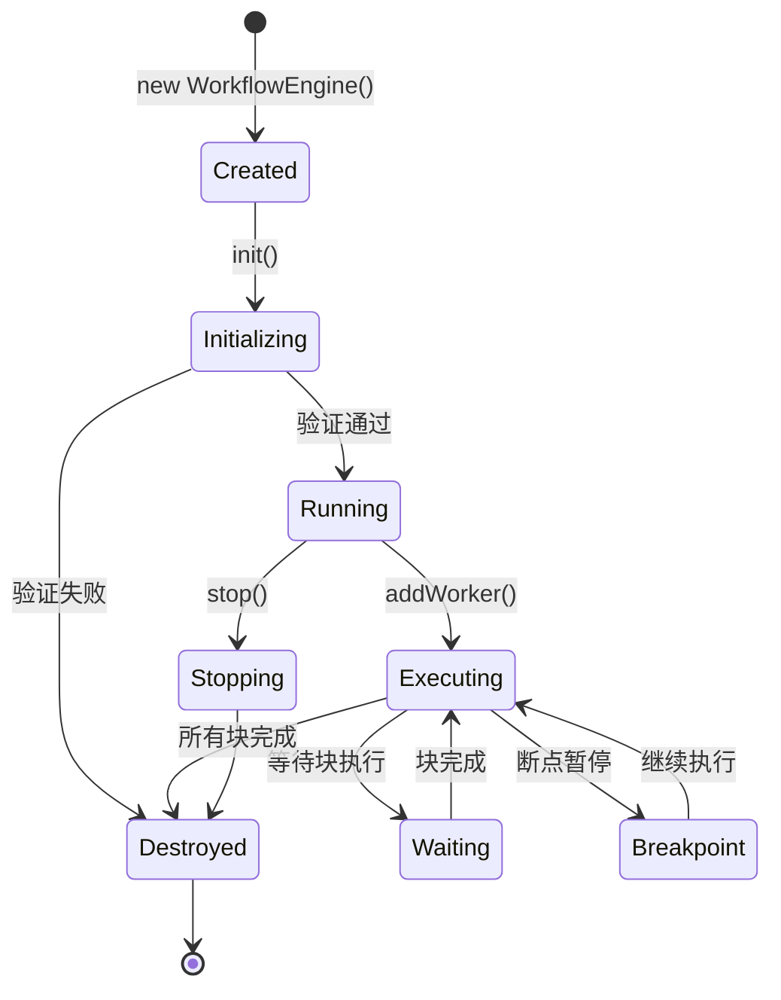
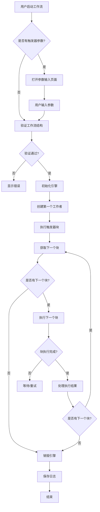
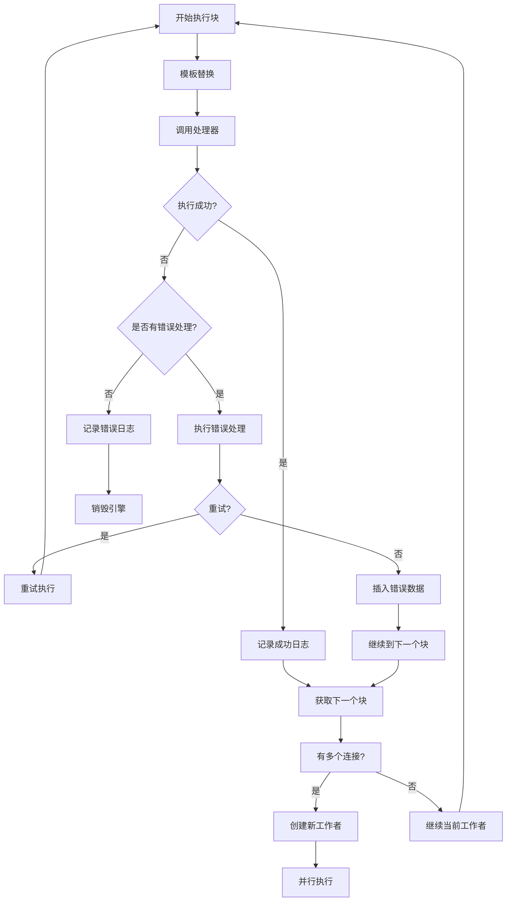
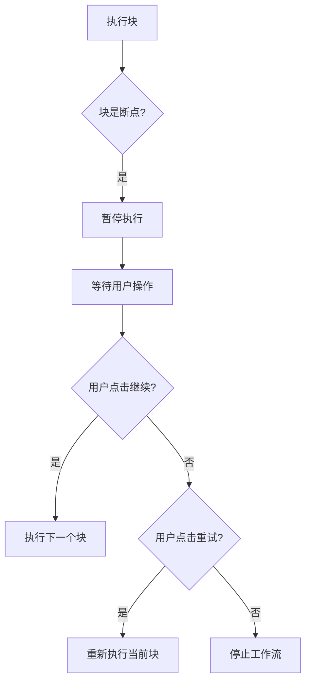

# 工作流引擎 (Workflow Engine) 详解

工作流引擎是 Automa 的核心执行引擎，负责解析、调度和执行工作流中的所有块（Blocks）。本文档详细介绍了工作流引擎的架构设计和实现细节。

---

## 核心组件

### 1. WorkflowEngine 类

**文件**: `src/workflowEngine/WorkflowEngine.js`

工作流引擎主类，管理整个工作流的生命周期。

```javascript
class WorkflowEngine {
  constructor(workflow, { states, logger, blocksHandler, isPopup, options }) {
    this.id = nanoid();                    // 引擎唯一标识
    this.workflow = workflow;              // 工作流数据
    this.states = states;                  // 状态管理器
    this.logger = logger;                  // 日志记录器
    this.blocksHandler = blocksHandler;    // 块处理器
    this.workers = new Map();              // 工作者映射
    this.referenceData = {                 // 引用数据
      variables: {},                       // 变量
      table: [],                           // 表格数据
      secrets: {},                         // 敏感信息
      loopData: {},                        // 循环数据
      workflow: {},                        // 子工作流数据
      googleSheets: {},                    // Google Sheets 数据
      globalData: {},                      // 全局数据
    };
  }
}
```

#### 核心方法

| 方法 | 参数 | 返回 | 说明 |
|------|------|------|------|
| `init()` | 无 | Promise<void> | 初始化引擎，验证工作流结构，创建第一个工作者 |
| `addWorker(detail)` | detail: Object | void | 创建新工作者执行指定块 |
| `stop()` | 无 | Promise<void> | 停止工作流执行 |
| `destroy(status, message, blockDetail)` | status, message, blockDetail | Promise<void> | 销毁引擎，清理资源，保存日志 |
| `updateState(data)` | data: Object | Promise<void> | 更新工作流状态 |
| `on(name, listener)` | name: string, listener: Function | void | 注册事件监听器 |
| `dispatchEvent(name, params)` | name: string, params: any | void | 派发事件 |

#### 生命周期



### 2. WorkflowWorker 类

**文件**: `src/workflowEngine/WorkflowWorker.js`

工作者类，负责执行单个工作流块。

```javascript
class WorkflowWorker {
  constructor(id, engine, options = {}) {
    this.id = id;                    // 工作者 ID
    this.engine = engine;            // 父引擎引用
    this.activeTab = {               // 活动标签页
      url: '',
      frameId: 0,
      frames: {},
      groupId: null,
      id: null,
    };
    this.currentBlock = null;        // 当前执行块
    this.loopEls = [];               // 循环元素列表
    this.loopList = {};              // 循环数据列表
  }
}
```

#### 核心方法

| 方法 | 参数 | 返回 | 说明 |
|------|------|------|------|
| `init({ blockId, execParam, state })` | 初始化参数 | void | 初始化工作者，开始执行第一个块 |
| `executeBlock(block, execParam, isRetry)` | block, execParam, isRetry | Promise<void> | 执行单个块 |
| `executeNextBlocks(connections, prevBlockData, nextBlockBreakpointCount)` | 连接、数据、断点计数 | void | 执行下一个块 |
| `setVariable(name, value)` | 变量名, 值 | Promise<void> | 设置变量 |
| `addDataToColumn(key, value)` | 列名, 值 | void | 添加数据到表格 |
| `_sendMessageToTab(payload, options, runBeforeLoad)` | 消息载荷, 选项 | Promise<any> | 发送消息到内容脚本 |
| `cleanup()` | 无 | void | 清理资源 |

### 3. WorkflowState 类

**文件**: `src/workflowEngine/WorkflowState.js`

工作流状态管理器，使用 BroadcastChannel 进行跨上下文通信。

```javascript
class WorkflowState {
  constructor() {
    this.states = new Map();           // 状态映射
    this.channel = new BroadcastChannel('automa-workflow-state');
  }
}
```

### 4. WorkflowLogger 类

**文件**: `src/workflowEngine/WorkflowLogger.js`

工作流日志记录器，将执行日志保存到 IndexedDB。

---

## 块处理器 (Blocks Handler)

块处理器负责执行各种类型的工作流块。

### 目录结构

```
src/workflowEngine/blocksHandler/
├── handlerActiveTab.js          # 激活标签页
├── handlerAiWorkflow.js         # AI 工作流
├── handlerBlockPackage.js       # 块包
├── handlerBlocksGroup.js        # 块组
├── handlerBrowserEvent.js       # 浏览器事件
├── handlerClipboard.js          # 剪贴板
├── handlerCloseTab.js           # 关闭标签页
├── handlerConditions.js         # 条件判断
├── handlerCookie.js             # Cookie 操作
├── handlerCreateElement.js      # 创建元素
├── handlerDataMapping.js        # 数据映射
├── handlerDelay.js              # 延迟
├── handlerDeleteData.js         # 删除数据
├── handlerElementExists.js      # 元素存在检查
├── handlerExecuteWorkflow.js    # 执行工作流
├── handlerExportData.js         # 导出数据
├── handlerForwardPage.js        # 前进一页
├── handlerGoBack.js             # 后退一页
├── handlerGoogleSheets.js       # Google Sheets
├── handlerHandleDialog.js       # 处理对话框
├── handlerHandleDownload.js     # 处理下载
├── handlerHoverElement.js       # 悬停元素
├── handlerIncreaseVariable.js   # 增加变量
├── handlerInsertData.js         # 插入数据
├── handlerInteractionBlock.js   # 交互块基础
├── handlerJavascriptCode.js     # JavaScript 代码
├── handlerLink.js               # 链接操作
├── handlerLogData.js            # 记录数据
├── handlerLoopBreakpoint.js     # 循环断点
├── handlerLoopData.js           # 循环数据
├── handlerLoopElements.js       # 循环元素
├── handlerNewTab.js             # 新标签页
├── handlerNewWindow.js          # 新窗口
├── handlerNotification.js       # 通知
├── handlerParameterPrompt.js    # 参数提示
├── handlerProxy.js              # 代理
├── handlerRegexVariable.js      # 正则变量
├── handlerReloadTab.js          # 重载标签页
├── handlerRepeatTask.js         # 重复任务
├── handlerSaveAssets.js         # 保存资源
├── handlerSliceVariable.js      # 切片变量
├── handlerSortData.js           # 排序数据
├── handlerSupabaseStorage.js    # Supabase 存储
├── handlerSwitchTab.js          # 切换标签页
├── handlerSwitchTo.js           # 切换框架
├── handlerTabUrl.js             # 标签页 URL
├── handlerTakeScreenshot.js     # 截图
├── handlerTrigger.js            # 触发器
├── handlerWaitConnections.js    # 等待连接
├── handlerWebhook.js            # Webhook
├── handlerWhileLoop.js          # While 循环
└── handlerWorkflowState.js      # 工作流状态
```

### 处理器接口

所有块处理器遵循以下接口：

```javascript
/**
 * @param {Object} block - 块数据
 * @param {Object} context - 执行上下文
 * @param {Object} context.refData - 引用数据
 * @param {Object} context.prevBlock - 前一个块
 * @returns {Promise<Object>} 执行结果
 */
async function handlerBlock(block, { refData, prevBlock }) {
  return {
    data: '...',           // 传递给下一个块的数据
    nextBlockId: [...],    // 下一个块的连接
    status: 'success',     // 执行状态
    logId: '...',          // 日志 ID
  };
}
```

---

## 模板引擎 (Templating)

工作流引擎使用 Mustache 风格的模板引擎进行变量替换。

### 目录结构

```
src/workflowEngine/templating/
├── index.js              # 主入口
├── mustacheReplacer.js   # Mustache 替换器
├── renderString.js       # 字符串渲染
└── templatingFunctions.js # 模板函数
```

### 引用数据键

| 键 | 描述 | 示例 |
|----|------|------|
| `{{table}}` | 表格数据 | `{{table.productName}}` |
| `{{variables}}` | 变量 | `{{variables.count}}` |
| `{{loopData}}` | 循环数据 | `{{loopData.item}}` |
| `{{globalData}}` | 全局数据 | `{{globalData.config}}` |
| `{{prevBlockData}}` | 上一个块数据 | `{{prevBlockData}}` |
| `{{activeTabUrl}}` | 当前标签页 URL | `{{activeTabUrl}}` |
| `{{workflow}}` | 工作流数据 | `{{workflow.id}}` |
| `{{secrets}}` | 敏感信息 | `{{secrets.apiKey}}` |

---

## 执行流程

### 1. 整体流程



### 2. 块执行流程



### 3. 并行执行

当一个块有多个输出连接时，工作流引擎会创建多个工作者并行执行：

```javascript
executeNextBlocks(connections, prevBlockData, nextBlockBreakpointCount) {
  connections.forEach((connection, index) => {
    const { id } = connection;
    
    if (index === 0) {
      // 第一个连接由当前工作者执行
      this.executeBlock(this.engine.blocks[id], { prevBlockData, ... });
    } else {
      // 其他连接创建新工作者并行执行
      const state = cloneDeep({
        windowId: this.windowId,
        loopList: this.loopList,
        activeTab: this.activeTab,
        // ... 其他状态
      });
      
      this.engine.addWorker({
        state,
        execParam: { prevBlockData },
        blockId: id,
      });
    }
  });
}
```

---

## 错误处理

### 块级错误处理

每个块可以配置错误处理行为：

```javascript
{
  onError: {
    enable: true,           // 启用错误处理
    retry: true,            // 启用重试
    retryTimes: 3,          // 重试次数
    retryInterval: 1,       // 重试间隔（秒）
    toDo: 'continue',       // 错误时行为：'continue' | 'fallback' | 'error'
    errorMessage: '',       // 自定义错误信息
    insertData: true,       // 插入错误数据
    dataToInsert: [         // 要插入的数据
      { type: 'variable', name: 'error', value: '{{error.message}}' }
    ]
  }
}
```

### 工作流级错误处理

```javascript
{
  settings: {
    onError: 'stop-workflow',  // 'stop-workflow' | 'keep-running' | 'restart-workflow'
    restartTimes: 3,           // 重启次数
  }
}
```

---

## 断点调试

工作流引擎支持断点调试功能：



---

## 性能优化

### 1. 资源清理

工作者类实现了 `cleanup()` 方法来释放资源：

```javascript
cleanup() {
  // 清除定时器
  if (this.timers) {
    this.timers.forEach((timer) => clearTimeout(timer));
    this.timers.clear();
  }
  
  // 清除间隔器
  if (this.intervals) {
    this.intervals.forEach((interval) => clearInterval(interval));
    this.intervals.clear();
  }
  
  // 移除消息监听器
  if (this.messageListeners) {
    this.messageListeners.forEach((listener) => {
      try {
        BrowserAPIService.runtime.onMessage.removeListener(listener);
      } catch (e) {}
    });
    this.messageListeners.clear();
  }
}
```

### 2. 日志限制

```javascript
class WorkflowEngine {
  constructor() {
    this.logsLimit = 1001;  // 日志数量限制
  }
}
```

### 3. 内存优化

引擎在 `destroy()` 方法中清理所有引用：

```javascript
async destroy() {
  // 清理工作者
  this.workers.forEach((worker) => {
    worker.cleanup && worker.cleanup();
  });
  this.workers = null;
  
  // 清理定时器
  if (this.timers) {
    this.timers.forEach((timer) => clearTimeout(timer));
    this.timers = null;
  }
  
  // 清理引用
  this.referenceData = null;
  this.eventListeners = null;
}
```

---

## 状态持久化

### 保存状态

```javascript
async updateState(data) {
  const state = {
    ...data,
    tabIds: [],
    currentBlock: [],
    name: this.workflow.name,
    logs: this.history,
    startedTimestamp: this.startedTimestamp,
  };
  
  await this.states.update(this.id, { state });
}
```

### 恢复状态

```javascript
// 在 init() 中
if (this.workflow.settings.reuseLastState) {
  const lastStateKey = `state:${this.workflow.id}`;
  const value = await BrowserAPIService.storage.local.get(lastStateKey);
  const lastState = value[lastStateKey];
  
  if (lastState) {
    Object.assign(this.columns, lastState.columns);
    Object.assign(this.referenceData, lastState.referenceData);
  }
}
```

---

## 与内容脚本通信

工作者通过 `_sendMessageToTab()` 方法与内容脚本通信：

```javascript
async _sendMessageToTab(payload, options = {}, runBeforeLoad = false) {
  const messagePayload = {
    isBlock: true,
    debugMode: this.settings.debugMode,
    executedBlockOnWeb: this.settings.executedBlockOnWeb,
    loopEls: this.loopEls,
    activeTabId: this.activeTab.id,
    ...payload,
  };
  
  const data = await BrowserAPIService.tabs.sendMessage(
    this.activeTab.id,
    messagePayload,
    { frameId: this.activeTab.frameId, ...options }
  );
  
  return data;
}
```

---

## 扩展点

### 1. 自定义块处理器

要添加新的块处理器：

1. 在 `src/workflowEngine/blocksHandler/` 创建 `handlerXXX.js`
2. 在 `src/workflowEngine/WorkflowEngine.js` 的 `blocksHandler()` 中注册

### 2. 自定义模板函数

在 `src/workflowEngine/templating/templatingFunctions.js` 中添加：

```javascript
export const templatingFunctions = {
  async customFunction(value, ...args) {
    return result;
  },
};
```

### 3. 自定义触发器

在 `src/utils/workflowTrigger.js` 的 `workflowTriggersMap` 中添加：

```javascript
const workflowTriggersMap = {
  'custom-trigger': registerCustomTrigger,
};
```
