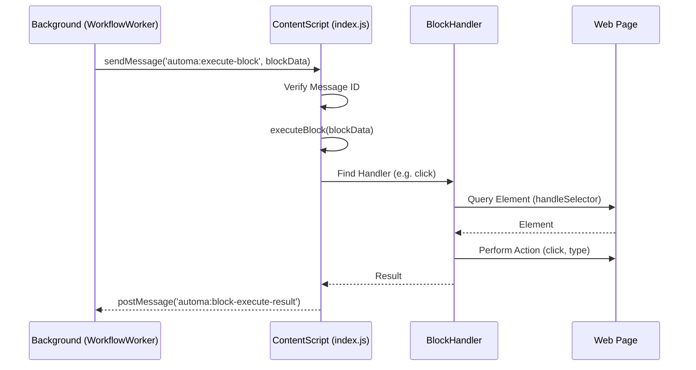

# Content Module Analysis

## Description
The Content module consists of scripts injected into web pages. It acts as the "hands" of Automa, performing actions like clicking, typing, and scraping data directly in the browser tab.

## Key Files

### `src/content/index.js`
The main entry point injected into pages.
- **Responsibilities**:
    - Listens for `automa:execute-block` messages from the background.
    - Delegates execution to specific handlers.
    - Handles iframe communication (relaying messages to frames).
    - Captures context menu data (selected text, link, media).
    - Proxies `fetch` requests to the background to bypass CORS/CSP.

### `src/content/handleSelector.js`
Utilities for finding and querying DOM elements.
- **Responsibilities**:
    - Supports CSS Selectors and XPath.
    - Handles Shadow DOM traversal.
    - Provides `queryElements` helper.

### `src/content/blocksHandler.js`
Registry for content-side block handlers.
- **Function**: Similar to the engine's block handler, it loads scripts that perform specific DOM actions (e.g., `handlerEventClick.js`, `handlerGetText.js`).

## Call Flow: Block Execution on Page

## Key Features

1.  **Element Selection**:
    - Supports robust element selection strategies (CSS, XPath).
    - Can target elements inside iframes and Shadow DOM.

2.  **Iframe Handling**:
    - Automatically detects if a target element is inside an iframe.
    - Uses `postMessage` to coordinate with the content script running inside the iframe.

3.  **Command Palette**:
    - Injects a command palette (`src/content/commandPalette`) into the page for quick workflow execution.

4.  **Element Picker**:
    - Injects an element selector overlay (`src/content/elementSelector`) to help users pick elements when building workflows.
